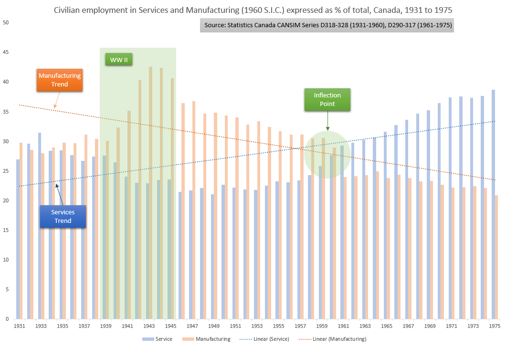
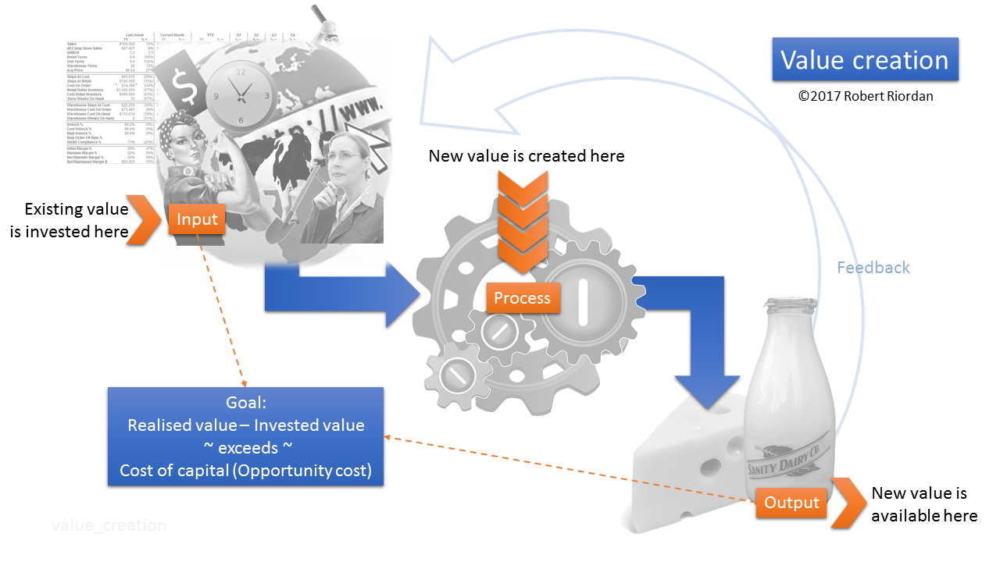

# Preamble (in which we introduce some critical context)

Intro to ICT for the average smart person

=======

Source: http://xkcd.com/1352/

***Welcome to our course!***

Order: 
1. Information
2. Communication
3. Technology

Themes that will run through this text and course:

Theme 1) Are we talking data, information or knowledge?

Theme 1B) Context… 

Theme 2) Is what we are examining a tangible or an intangible?

This distinction is larger and more important than the traditional one made in most introductory information system classes. We were wont to say that tangible things are those with a physical presence that we can touch, such as a computer or a smartphone. Intangible was something that, while it exists, cannot be weighed, measured or directly detected, such as software. While these distinctions are still valid, it’s bigger than that. Read on.
It started slowly, then picked up steam in the 1960s. What was it? It was the switch from the production of tangible goods to intangible services in the post-industrial era.  Indeed the proportion of Canadians employed in the _secondary_ sector (_primary_ roughly being agriculture, mining and extraction, forestry, etc. and _tertiary_ being the services sector) has declined steadily over time.  

Figure AF. Proportion of Canadians employed in the secondary and tertiary industries, 1931 to 1975.

Examination of Figure AF shows some interesting trends. With the exception of the period during which Canada was at war (1939 – 1945), the proportion of Canadians of both sexes who were employed in the manufacturing sector has been in steady decline. On the other hand, there has been a steady rise, clearly since the inflection point at right around 1960, in jobs in what we call the _service sector_. The trend lines in the graph clearly show the history. These trends have extended into the present day, where in 2014, using the percent of GDP generated by these sectors as an indicator, Policy Horizons Canada, using Statistics Canada data from 2011 and 2012, reported that activity in Manufacturing accounted for 13% while Service accounted for 72% of Canada’s GDP. Natural resource extraction and Other combined account for the remaining 15%.  Indeed [Statistics Canada](http://www.statcan.gc.ca/tables-tableaux/sum-som/l01/cst01/labor10b-eng.htm) reported that in 2014, the number of employed Canadians in manufacturing had sunk to 9.6% (in 1975 it was over 20%) while the number in services has skyrocketed to 78.1%.

[Interested?](http://www.horizons.gc.ca/eng/content/significant-shifts-key-economic-sectors)

Here is what Policy Horizons had to say about it: _“The Canadian economy is dominated by the services industry, which makes up 72% of GDP and employs 78% of Canada's workforce. The services sector includes accommodation, business, cultural, education, financial, food, health care, information, professional, retail, transportation, wholesale and a range of other services. The sub-sectors that contribute the most to GDP include finance, insurance and real estate services (29% of total services), health care and social assistance (9.3%), retail trade (8.6%), public administration (8.2%) and wholesale trade (8%).”_
There are multiple reasons for these seismic shifts, but the nuances are best left to the labour economists and policy wonks. For our purposes, it matters not at all _why_, but rather only _that_. And it matters for the remainder of the so-called _advance economies_ as well (according to [World Bank data](http://data.worldbank.org/data-catalog/GDP-ranking-table) for 2013, Canada ranked 11th in terms of the size of our economy by GDP).  All advanced economies have experienced relatively the same shift over the same period (see the 1998 [IMF study](https://books.google.ca/books?id=-05vo38wz-IC&dq=advanced+economies+shift+from+manufacturing&source=gbs_navlinks_s)), and the economies of the currently modernising countries (China, India, Brazil among others) will experience the same shift towards intangible, knowledge-based contribution to GDP. 

As my eldest granddaughter Kiana was wont to ask repeatedly when younger “But why grandpa?”, we ask why it matters that the world’s largest economies are increasingly dominated by service providers. 
The Policy Horizons (ibid.) piece has this to offer:  _“Economic growth increasingly linked to intangibles: The shift from a goods economy to a knowledge economy has increased the importance of intangibles. Intangible assets include brand, customer base, design, human capital, intellectual property and [not physical but rather interpersonal] networks, among others, which are all essential aspects driving firm value. Investments in intangible assets are an increasingly important source of growth that could result in a new range of business services. Also reshaping services is the rise of intangible artifacts through the digitization of information and arts. Freed from the resource constraints of physical production, the economics of these markets are being transformed by a shift from relative scarcity to relative abundance, suggesting a need for different pricing mechanisms. New monetization models are emerging, no longer centred on ownership but access, such as online subscriptions or the use of targeted advertising powered by data analytics. The greater ease of replicating intangible artifacts has also increased piracy and intellectual property concerns.”_

Careful reading of this passage reveals that we are firmly and irrevocably in what Goldfinger (http://www.idate.fr/fic/revue_telech/68/goldfing.pdf; accessed April 17, 2015) has termed _The Intangible Economy._ He writes “Knowledge Economy, Digital Economy, Information Society, Experience Economy, names for the new economy proliferate to the point of becoming ubiquitous buzzwords.” Furthermore, in trying to describe the new economy, he offers “I would like to suggest an alternative framework, based on a single defining trend: the shift from tangible to intangible. The economic landscape of the present and future is no longer shaped by physical flows of material goods and products but by ethereal streams of data, images and symbols.” And finally “At the core of the agricultural economy, there was a relationship between man, nature and natural products. The core relationship of the industrial economy was between man, machine and machine-created artificial objects. The intangible economy is structured around relationships between man and ideas and symbols. The source of economic value and wealth is no longer the production of material goods but the creation and manipulation of intangible content. _We live in the intangible economy_ [emphasis added].”

Though the paper is a little dated (published in 2000), it remains quite viable today. A clever metric is reproduced below wherein the physical weight of certain commodities is expressed in terms of their cost in USD. It’s surprising.

| :-: | -: | :- | :- |

Artifact Price (USD)	Weight (pounds)	Unit price (USD/lb.)
Pentium III	                     851	           0.001984	        42893.00
Viagra	                         8	           0.000680	        11766.00
Gold	                     301	           0.625000	        48277.00
Mercedes Benz E-class	                78445	    4134.000000	               19.00
Hot rolled steel	                     370	    2000.000000	                 0.20

(Goldfinger quotes the source of this data as _Colvin, Fortune Magazine_, but does not provide the full citation in his paper. We’ll have to take it at face value.)

It’s indeed interesting to see that the pinnacle of costliness is still gold (in this limited comparison) but not far behind was the Intel P3 processor (the most powerful microprocessor at the time). Note also the relatively cheap cost per pound of the Mercedes in comparison to Viagra, for example.  There’s plenty I could write about how gold, Mercedes and Viagra might work together but I will spare you just this one time. 

What’s the point of this? It is to demonstrate the shift to what LSE professor Danny Quah (see the Goldfinger article for the reference (http://www.idate.fr/fic/revue_telech/68/goldfing.pdf)) has called the _increasingly weightless economy_ where more and more GDP is generated by “economic commodities that have little or no physical manifestations.” While this shift is not inherently due only to the so-called _digital revolution_ it is also clear that much of the intangible output in this new economy is produced by or requires information and communication technology to unlock its value. 

We live in an increasingly digitised world. Consider a simple example: a hockey game.  Time was the only one way to enjoy the event was in person. Consider the myriad of ways that event can be enjoyed today, both synchronously (in real time) and asynchronously (not in real time).  See Figure TT below.

Figure TT. Disassociation of content, time and support. 

Let’s unpack this busy graph. The event is a hockey game. In the early days of such games, they were played on local frozen ponds and then on makeshift rinks, and only when the temperature was below freezing. The teams were made up mostly of locals, and the fans, if there were such hardy souls, were locals rooting for their local boys. In order to experience the game, it was necessary to attend in person. There wasn’t even any press to report on the match. The only artefacts produced by the games were those in the memories of those in attendance, and any anecdotal scribblings of a local historian or scribe. Those were the days indeed.

As the cities and towns grew, so too did the rivalries. More and more attention was paid to sporting events and more archival material became available in the form of photographs and perhaps even some grainy film. Players began to receive small _rewards_ for their efforts. Firms became interested in having their name associated with a winning side (as brand management). When real money enters the picture, interest picks up. More people attend the games. More widespread interest in the outcomes is aroused. This spiral of interest and investment leads to capacity problems at the arenas. Not enough seats for willing purchasers, and the widespread interest leads to the inability for _fans_ to attend due to long travel times and cost.

Enter new support systems. The dawn of commercial radio, and then television, led to the ability for remote fans to enjoy at least some of the _in-person_ experience of a sporting event in the comforts of their own home. This revolution required what Goldfinger calls _supports_ and what we might think of as technology (which includes print media). Supports are the things that allow us to have a _near-real-time_ experience of an event occurring in some other place. 

I remember way back to the 1965-66 Junior “A” hockey season, the last where legendary Bobby Orr played for my hometown Oshawa Generals, and I was all of 13 years old. There was no TV coverage at all but I owned a gorgeous little compact transistor radio, powered by the very first 9-volt batteries,  that I hid under my pillow so I could listen to the games as the Generals travelled to exotic locations around the country to beat first the St. Catherine’s Black Hawks, then the Montréal Junior Canadiens (at that time playing in the Ontario Hockey League) and finally the Kitchener Rangers to win the J. Ross Robertson trophy emblematic of OHA (not yet the OHL) supremacy. The Oshawa side then went on to best the North Bay Trappers (by a combined score of 43-9 over four games) and finally the Shawinigan Bruins in three straight in a best-of-five to earn the right to represent the eastern provinces in the Memorial Cup.  

Oshawa lost to the Edmonton Oil Kings in the national final, with Orr playing hurt and finally reputedly being benched on orders from his new masters, the Boston Bruins, who had drafted and signed him to an NHL contract. Orr’s bad knees were legendary, even at 17 years of age. 

While the pain of losing that Memorial Cup series to the Oil Kings is still palpable, so is the sheer excitement of listening in near real-time as the games unfolded in faraway places. That little Candle transistor radio was my support. By the same token, I remember well watching the Toronto Maple Leafs (my dad’s team – I was a Bruin’s fan as Oshawa was a Boston feeder team) win their last ever Stanley Cup, in 1967, when I was the tender age of 14… alas. This was the golden age of _broadcasting_, or sending a single signal to many receivers, in this case, most of the TV sets in Canada.  

This explains the first two spheres on Figure TT, numbered 1 and 2, extending the in-person experience to the home, through early radio and then TV.  Sphere number three is a bit more complex, as it introduces the confounding influence of _synchronicity_ to the equation. Attending the game, or listening via radio or watching on TV are all _synchronous_ events – experienced in real time (or very near real time taking _latency_ into account).  Sphere number three, labelled _Anywhere_, shows that it’s not necessary to be _tethered_ to a location in order to experience an event. The automobile radio and the portable transistor radio were the first to _cut the cord_ as it were, allowing the very first _roaming_ experience. 

Today the ability to consume anything, anywhere, in real time is taken for granted. Thus we have a myriad of ways to experience the game, including streaming services available wherever the internet is available, on devices such as desktop and laptop computers, tablets, smartphones and smart TVs, most of which are quite portable. Commercial providers offer services varying from streamed audio, streamed audio/video, to instant, _bite-sized_ updates in various forms depending on the device in use.  All these are on the synchronous side of the equation. Asynchronous media include newspaper reports, news media on radio and TV reporting (which are nothing new at all), as well as our own capacity, with a Portable Video Recorder (PVR), to _tape_ an event and dissect it at any time later in all its stop and start, slow-motion glory. Time is no longer in the equation. 

And that covers the commercial providers. Increasingly important, however, is our own ability to report (share) the real-time experience for both synchronous and asynchronous consumption. Witness the rise of social media and the concept of _narrowcasting_.  Twitter and Facebook are narrowcasting technologies, narrow being defined relatively. Twitter supports narrow communities of _followers_ and Facebook the same concept, referred to as _friends_. I don’t need to explain these platforms to you. 

Let’s think about what could happen at a public event, such as our hockey game. With social media, you could easily narrowcast through any number of platforms. Your followers and friends could consume, in near synchronicity, your experience of the game. But let’s go farther afield and consider that you could also narrowcast a live stream of the event through technologies such as _periscope_, which allows anyone with a camera and a connection to the internet to live stream any event. You are the new CBC. An emerging Sportsnet. A nascent Hockey Night in Canada. 

Ok so cool enough. But consider that you can be Tweeting, Facebooking and _periscoping_ in real time _inside the venue_ where the event is happening. Others in your sphere could well be consuming your narrowcasts, and by the same token you could be consuming theirs.  This adds a whole new dimension to the model. Finally, you could also be live narrowcasting the game to anyone on the other end of a cell phone call, or recording your play-by-play on a voicemail recorder for later consumption and analysis. 

All of this represents a wrinkle in the space-time continuum of synchronicity and location. But what’s the bottom line here? Why does this matter other than being really cool and other than actually making it considerably less likely that we will enjoy an in-person, synchronous event? (Next time you either attend or watch a major event such as the opening or closing of the Olympic Games, note how many people are recording it, watching the pageantry through a tiny camera screen, to be played back… never?)

There is no denying that the majority of the _weightless_ or the _digital_ or the _intangible economy_ is if not driven by, at least facilitated by, information and communication technology. So to fully participate, it’s necessary to be well versed in the technology – not necessarily to be able to _create_ new technology but clearly to be able to _leverage_ it. To understand it well enough to be able to see how it can solve problems or create opportunities for competitive advantage. 

And it’s also important because of ownership. And ownership is all about business because business sells access to events such as hockey games. This is why it’s a revolution. The ownership model is completely upside-down now.  The ability to participate in (consume) an event is now available to any and all with a support mechanism (technology) and an internet connection (technology). So ownership of that event is now widely dispersed. Who, for example, owns the rights to a Tweet or a FB post or indeed to a live stream via periscope of a hockey game? And the pricing for consumption is now multi-tiered. In fact, one could argue that the price to consume many events (or movies or broadcasts of any kind) has been reduced to the hit you take on your data plan. So how to generate revenue from events? 

This at least partly explains the consolidation among entertainment providers (see the infographic below for US entertainment industry) and also why the former content _purveyors_ (such as Rogers and Bell) are now content _producers_ (owning major league sports teams for example, and buying up sports broadcasting properties (while Bell owns at least part of TSN, for example, and Rogers owns the Blue Jays as well as their ball park, and at the time of writing, they together hold a nearly 80% share in Maple Leaf Sports and Entertainment, which owns major league teams in three leagues as well as considerable prime real estate.)  So the folks who formerly _brought you_ the product (via the internet), now own the venues, the product and the distribution channels. 

If they don’t follow this model, they risk being shoved aside by the content producers. They’ve become the creators rather than the purveyors. Shomi is a Rogers – Telus joint response to Netflix (isn’t it fun when competitors get in bed with each other – this is the definition of a strategic partnership). Bell’s CraveTV is the same. It’s the only way to compete in this world of intangible products. And it’s due in large part to the _digital revolution_. 
 http://www.dailyinfographic.com/wp-content/uploads/2015/04/IllusionofChoice.jpg
The Policy Horizons article is excellent in its entirely, below is the most important stuff from our perspective:
“While a large part of the services sector will continue to include low-skilled work, some significant shifts for an economy that increasingly revolves around services are highlighted below.
“Economic growth increasingly linked to intangibles: The shift from a goods economy to a knowledge economy has increased the importance of intangibles. Intangible assets include brand, customer base, design, human capital, intellectual property and networks, among others, which are all essential aspects driving firm value. Investments in intangible assets are an increasingly important source of growth that could result in a new range of business services. Also reshaping services is the rise of intangible artifacts through the digitization of information and arts. Freed from the resource constraints of physical production, the economics of these markets are being transformed by a shift from relative scarcity to relative abundance, suggesting a need for different pricing mechanisms. New monetization models are emerging, no longer centred on ownership but access, such as online subscriptions or the use of targeted advertising powered by data analytics. The greater ease of replicating intangible artifacts has also increased piracy and intellectual property concerns.
“Employers cater to the "creative class": As developed economies have found their value through knowledge creation and innovation activities, "creative class" workers (e.g., scientists, engineers, media workers, designers) in the services sector have seen their market worth rise, while blue-collar workers and low-skilled service workers have seen little growth in their relative value, even though the latter still dominate the services industry. These creative workers tend to seek to live in diverse and creative cities and are comfortable working in flexible work arrangements such as online employment or self-employment. With the expectation of greater future competition for creative class workers, their preferences may be influential in determining workplace norms and firm location choice (Florida, 2002).
“Services increasingly crossing borders: Some service firms may find that the need for proximity to their workers becomes a moot point. Information communication technologies have facilitated the off-shoring and exporting of service tasks, which to date have largely been limited to the fields of architecture, engineering, finance, education and research and development. Services have traditionally been less tradable than goods, particularly in the most customer-facing industries such as retail and health care (Farrell et al., 2005). However, even in these fields, virtual and communications technologies are advancing the ability to bridge distance and offer personalized service, for instance through mobile health tools and applications, remotely controlled robots for high-precision surgeries, and the use of avatars and "virtual fitting rooms" to aid online shopping for clothes. Within firms, developments in virtual technologies that can easily reproduce the human interface could expand the tradability of other service tasks, forging a pathway for the greater participation of "virtual service workers." Where employers are challenged to find specialized skills in their local labour market, online contracting is seen as an advantage to fill needs quickly. The transnational nature of service provision raises important questions for Canada's labour market and Canadian service providers.
“Services influenced by an aging population: Many service industries will likely see greater demand due to the needs and preferences of an aging population (e.g., personal care, health, leisure, tourism, transportation, supplementary careers). At the same time, service industries are concerned about their ability to source specific skills as needed, as they anticipate a smaller working age demographic to fill these needs. Firms are exploring incentives to retain older workers (e.g., flexible work schedules) and interventions to delay the onset of chronic ailments that might limit their ability to keep workers (e.g., offering workplace wellness programs).”
From this you should clearly see that a big part of your ability to both create new and consume existing value in society will be fuelled and facilitated by ICT. That’s why we’re here. That’s why we study ICT. You are at university to learn how to become knowledge creators. Indeed that is exactly what you are doing as you train and study – creating intangible and, though we do try, almost immeasurable capacities for thought and synthesis and creation. The value you create in your career will not, in all likelihood, be measured on a weight scale (as in a bucket of made widgets), but rather on an ethereal scale that measures ideas, theories, mashups and disruptions. You will indeed be working in the weightless economy. Best to be prepared. 
To bring it home, it’s increasingly a service-based economy. Services are weightless. And the contribution of services to GDP vis-à-vis manufacturing is growing at an increasing pace. Evidence Figure MD:
Figure MD. Contribution to GDP from Services and Manufacturing from 1961 to 2006, Canada

Theme 3) Does this (technology/service/data/etc.) either shrink input or grow output or both? If neither, is there any value to it? The short answer is no. That's the medium and the long answer as well. 

A McKinsey piece on capitalism proposes that the purpose of business is to solve problems. Here's the quote: "... the crucial contribution business makes to society is transforming ideas into products and services that solve problems." They go on to specify that if problems are solved at an increasing rate, prosperity results. If this is true (and it makes good sense to me on the surface) then our task as we study technology becomes to determine if the product or service or technology under consideration (which is the tangible manifestation of a new idea) solves a _real_ problem. 

But it also seems to me that something is missing from the McKinsey postulation. And that something is _profit_. Under capitalism, for an enterprise to remain viable, it must either be supported externally or must generate a competitive return on investment. Nothing is free. Everything (and I mean everything) has a cost. So cancer research (cancer being the problem) can be supported by governments through their revenues, derived mainly from taxation. So you and I pay for that research. Some cancer research is also undertaken by private enterprise (pharmaceutical firms and university research labs as funded research, for example), but private enterprise won’t (or can’t for long) go down a road without the reasonable expectation of recouping a premium over what they have invested in their work. This is ROI. This is the basis of free enterprise and of capitalism itself. 

It’s clear that problems don’t get solved for free. If business solves a problem, it must make a profit in so doing. But there’s also the age-old challenge of widening the gap between costs and revenues. It’s not enough to make a profit. The profit must _increase_ year over year. Grow the margins. Be more effective and/or more efficient. Expand the market, open new frontiers. Grow revenues and shrink costs, that’s what drives the system. Keep this in mind.

What is also interesting from the McKinsey piece is their contention that problems must be solved at an increasing rate. So this year we must solve more problems (either in absolute terms or as a rate) than last year and the year before that. Everything escalates under capitalism. Goods cost more, wages rise to meet the cost of goods and we live in this inflationary spiral which ebbs and flows but other than in rare periods of deflation (which are quickly corrected by monetary policy) is always with us. Problems must be solved at an increasing pace and profit must increase year over year. It’s enough to drive one mad. 

Thus the pace of everything is accelerating. This puts increasing pressure on the processes that business uses to solve problems.  What then is a process?

###Process
Figure SG. A simple process

A simple process, or a complex process, any process, has only three pieces. First, input is required. Once input is present, a process then transforms that input into output. That's it. Input --> Process --> Output. All three are necessary. No process without input, no input without process, no input and process without something coming out the other side. Make sure to understand that a process also requires a trigger: something to set it in motion. Processes don't just start of their own volition (if they had any) or momentum. Something must spur them into action. 

Our simple graphic above depicts the process of making dairy products (something my family did 100 years ago when their telephone number in Oshawa, Ontario was _7_. Yup, that’s it. Seven. 

To make dairy products, plenty of inputs are required, including wheat to feed the cows, milk from those cows, scientific know-how, elbow grease and muscle, expertise, time, land and, of all things, data). And lots more such as a farm and a dairy with machinery to bring it all together and a supply chain to move stuff in and out. The message is that in order to produce dairy, plenty of input is required.

These inputs are fed to the dairy process, and this process yields the output. Cheese and milk and yoghurt and ice cream. It’s pretty clear that  our little graphic represents a very high-level view of the dairy process. There are literally hundreds of other processes, linked in chains, that actually account for the production here. But each is the same; a simple process. How then, and where, is value added and profit realised? 

Let’s look at our process again, this time in light of value add. 

Figure Z. Value creation

Effectiveness = doing the right thing

Efficiency = doing the thing right

How does technology solve problems? Paradoxically, technological progress is not measured in terms of impact on the actual _process_ of doing anything. Business process is unaffected by technological change. This sounds heretical. What do you mean, _has no effect?_ In the simplest terms, technological progress is measured not in terms of process improvements, but rather by its impact on the inputs and outputs of the system -- the resultant decrease in required inputs (effectiveness – doing the right thing) or by an increase in realisable output given the same input (efficiency – doing the thing right). We know progress has occurred when inputs cost less for a given output or output is more plentiful or valuable from a given input. Simple. The value creation graphic shows this clearly.

###A working definition of progress
Assume a stable system where yesterday, 100 units of input produced 100 units of output. Progress has been achieved if today we get the same output from only 99 units of input. This is an increase in _ effectiveness_. We are making more _effective_ use of our input resources. On the other end of the system, progress has been achieved if today those 100 units of input produce 101 units of output. This is an increase in _efficiency._  We are doing more with what we have. 

Information and Communication Technology (ICT) operates in the process piece of business problem solving and its impacts are measured in two clear spheres. See the ICT Value creation graphic below.

Figure JD. ICT Value creation

Thus technology has an impact if it moves the needle on efficiency and/or effectiveness. That’s how we measure technological impact. Either it leads to cost savings or to increased output. It widens the margin between costs and revenues. It increases profit.  

What _real problems_ can technology solve? 

And a real problem is one that either has input or output challenges – and we know by now that those are the _only_ challenges. See the [McKinsey article](http://www.mckinsey.com/insights/corporate_social_responsibility/redefining_capitalism). 

Theme 4) We can think of this problem-solving capacity in terms of the traditional notion of the Value Proposition. A popular website that helps ecommerce firms maximise the worldwide web has this to say about the Value Proposition: "In a nutshell, value proposition is a clear statement that explains how your product solves customers’ problems or improves their situation (relevancy), delivers specific benefits (quantified value) [and] tells the ideal customer why they should buy from you and not from the competition (unique differentiation)." Ergo we ask what is the value proposition for this tech, app, service, etc.? If there is no VP, why bother?
[Interested?](http://conversionxl.com/value-proposition-examples-how-to-create/) (PS: The link to Austin, TX in the article is broken) 
Theme 5) Does this product/service/technology lead to a sustainable competitive advantage? This is developed in the context of both PERSONAL CA (such as FB  or Twitter, etc. - needs to be carefully defined but this definition will allow us to understand the corporate part) and CORPORATE CA (easier to define but must also encompass not-for-profit and government services).

###Data, information and knowledge

In the beginning, there was nothing. Or perhaps even less than that. Maybe *negative* nothing? But of course negative nothing is something, so maybe not. In any event, at the instant of the Big Bang (with apologies to Sheldon *et al*), there was instantly something. It was the very first binary data. Nothing, then everything. Zero then one. Off became on. Dark turned to light. Up or down became possible. In became different from out. You get the picture. And so it began. Nothing, then something. We've been collecting and interpreting data ever since. 

This section is lengthy (or at least lengthier that you might think is necessary from this end of the argument), but with good reason. We need to carefully consider the myriad differences between the Big Four of data, information, knowledge and wisdom. We need also to examine their intricate and intimate interrelationships in order to understand what Information Systems (or the broader term that I prefer - *Information and Communication Technology*) really is and what impact it has on our private and public lives. Let's get at it.

Let's first deal with a potential controversy. You might have heard (more likely you will hear) this hierarchy referred to as the Data, Information, Knowledge and *Wisdom* hierarchy. There are problems with this particular characterisation so instead, we describe the Data, Information and Knowledge hierarchy here. 

[[Interested?] ](https://hbr.org/2010/02/data-is-to-info-as-info-is-not)

First, let's carefully define what each means in its own right. We can then examine the hierarchy that evolves when discussing the Big Three in the context of decision making. Oh yes, and _context_ will be critical too. 

####Data

The excellent website (or service, really) [visualthesaurus.com](http://visualthesaurus.com) shows the visualisation, above, of the lookup term "Data" once expanded by clicking on the red node.  

The interpretation of the visual goes as follows: 
* A solid line between two terms denotes a relationship between a meaning and a word. Thus the term at the distal (far) end of a solid line can be used to express the meaning of the defined word.
* A dashed line indicates a "type of" relationship. Thus the term at the distal end of a dashed line indicates that this construct is a type of the term at the proximal (near) end of the dashed line. So "accounting data" is a "type of" data. Self-evident, really. 
* A dashed red line (not shown in this visual but appearing in others below) indicates an opposite. So a red line appearing between the terms "near" and "far" would indicate that they are a negation of each other. 

The Visual Thesaurus defines data as: "A collection of facts from which conclusions may be drawn." Hold onto this definition as we further analyse the complex relationship between data and information.

The visual on Data above implies (states, really) that data and information are synonymous; that they can be used to describe each other, and thus that they are equal. My definition, which clears up some of the ambiguity in the terms data and information, is: *Data is pre-information; potential information; a collection of one or more facts, figures or measurements of some entity whether tangible or not*.

The online [Business Dictionary](http://businessdictionary.com) defines data as: 
1. Information in raw or unorganized form (such as alphabets, numbers, or symbols) that refer to, or represent, conditions, ideas, or objects. Data is limitless and present everywhere in the universe. See also information and knowledge.
2. Computers: Symbols or signals that are input, stored, and processed by a computer, for output as usable information.

I respectfully disagree, ever so slightly, with these two definitions. Specifically, in definition #1, the word *information* should not appear. Rather, both definitions should begin with the words in the second definition, specifically that data are "symbols and codes" or indeed drawings or sounds or signs or even facial expressions that carry within them the *potential* for information but not information *per se*.  Data is raw and lacks context. A stream of digits, for example. Note the definition of information below, from the same source, and note that one of the necessary elements of information is that it be presented within a context that gives it meaning. Take a look. 

[[Interested?](http://www.businessdictionary.com/definition/data.html#ixzz3MHuObnyk)]

###Information

Our dictionary source offers that information is "Data that is:  
1. accurate and timely, 
2. specific and organized for a purpose, 
3. presented within a context that gives it meaning and relevance, and 
4. can lead to an increase in understanding and decrease in uncertainty."

Information is valuable because it can affect behavior, a decision, or an outcome. For example, if a manager is told his/her company's net profit decreased in the past month, he/she may use this information as a reason to cut financial spending for the next month. A piece of information is considered valueless if, after receiving it, things remain unchanged. For a technical definition of information see information theory."

[[Interested?]](http://www.businessdictionary.com/definition/information.html) 

Clearly, data cannot be both information and data at the same time, if the requirement for information is that it must be organised and in context. Data doesn't doesn't have the potential to change things (or lead to change). Data that can be understood, interpreted and put into context leads to information, which can effect changes in behaviour and can facilitate decision making. Now we're getting somewhere.

Wolfram|Alpha [describe this] has these 5 definitions of Information. Below are the 4 that bear on our study here:

1. a message received and understood 
2. knowledge acquired through study or experience or instruction 
3. noun a collection of facts from which conclusions may be drawn 
4. noun (communication theory) a numerical measure of the uncertainty of an outcome 

### Entropy
In the physical sciences the entropy associated with a situation is a measure of the degree of randomness. The second law of thermodynamics states that entropy always increases in the universe. High entropy equals high level of chaos.  [Me: Thus for decision making, entropy is the enemy. Entropy is "junk on the signal." It thwarts our efforts to make sense of a data transmission  and to translate data into information. While entropy and chaos and superfluous data provide richness in terms of the volume of signal being sent, they are useless in the context of seeking pointed, surgical, targeted information to answer a specific question.] From the yellow Curator article. 

####Information Theory
And let's look at Information Theory while we're here. Our dictionary defines it as:
"Basic data communication theory that applies to the technical processes of encoding a signal for transmission, and provides a statistical description of the message produced by the code. It defines information as choice or entropy and treats the 'meaning' of a message (in the human sense) as irrelevant. Proposed together by the US mathematicians Claude Shannon (1916-2001) and Warren Weaver (1894-1978) in 1949, it focuses on how to transmit data most efficiently and economically, and to detect errors in its transmission and reception."

[[Interested?](http://www.businessdictionary.com/definition/information-theory.html#ixzz3MJ2TuS7s)]

###Knowledge

How about knowledge? The Visual Thesaurus cogently defines knowledge as: "The psychological result of perception and learning and reasoning." So this definition explicitly excludes machines from having the capacity to *know something* since it refers to a "psychological result." Pity...  

But let's look at this visual for a second. Note how rich it is. Note how many nodes are of interest to us here. 

Further, the first definition from our Business Dictionary source is preferred over the second as it refers to the context of Law. Here's what's on offer:

"General: Human faculty resulting from interpreted information; understanding that germinates from [the] combination of data, information, experience, and individual interpretation. Variously defined as, "Things that are held to be true in a given context and that drive us to action if there were no impediments" (Andre Boudreau). "Capacity to act" (Karl Sweiby). "Justified true belief that increases an entity's capacity for effective action" (Nonaka and Takeuchi). "The perception of the agreement or disagreement of two ideas" (John Locke). In an organizational context, knowledge is the sum of what is known and resides in the intelligence and the competence of people. In recent years, knowledge has come to be recognized as a factor of production (see knowledge capital) in its own right, and distinct from labor."

[Interested? http://www.businessdictionary.com/definition/knowledge.html#ixzz3MI6pmqhU]

Data is useless unless in a context, which allows it to become information. Information drives decisions and decisions drive action, in the rich context of previous information. Collected information from this action, previous actions and from all other sources of knowledge becomes new or evolving knowledge and confers the ability to pass judgment on the previous three. 

[Google NGRAMS Maybe put this stuff below in the section on Big Data or elsewhere? Commented out now.]

So clearly we have a pathway beginning with measurement. Measurement gives meaning to data, which, in context, provides information. Information in its collectivity, produces knowledge. With information and knowledge (which I define as the intersection of collective information with enough experience to allow for sufficient clarity such that one can critique the process of marshaling data to information and then be prepared to engineer the environment so as to lead to better information in the future)...

### Communication

Communication is the essence of our being. Communication is almost all we do. Our friends at Wikipedia have this to say about that: "Communication (from Latin commūnicāre, meaning "to share") is the activity of conveying meaning through a shared system of signs and semiotic rules." [[Interested?]](http://en.wikipedia.org/wiki/Communication)

Semiotics is the study of signs and symbols in communication. [[Interested?]](http://www.amazon.ca/This-Means-That-Users-Semiotics/dp/1856697355/ref=sr_1_4?ie=UTF8&qid=1427474025&sr=8-4&keywords=semiotics)

We further can examine a subset of what [dicionary.com](http://dictionary.reference.com/browse/communication) offers: 
1. The act or process of communicating; fact of being communicated. 
2. The imparting or interchange of thoughts, opinions, or information by speech, writing, or signs. 
3. Something imparted, interchanged, or transmitted. 
4. A document or message imparting news, views, information, etc. 
6. Communications - means of sending messages, orders, etc., including telephone, telegraph, radio, and television. 
7. Biology: a) activity by one organism that changes or has the potential to change the behavior of other organisms; b) transfer of information from one cell or molecule to another, as by chemical or electrical signals.

Now isn't that interesting, the Biology parts? That's exactly what we are saying about Information. Specifically that we define information (that it emerges from data in a context) as something that is communicated and can cause *change*. So in nature, a large part of communication involves change, and such communication is achieved by the exchange of *information*. 

### Context

Visual Thesaurus definitions for context: 

1. Language that helps to determine its interpretation 
2. The set of facts or circumstances that surround a situation or event

Let's start right away by considering the notion of *context*. Here's what the online Oxford Reference has to say about it:

"Most broadly, any frame of reference or framework within which something is perceived, produced, consumed, communicated, interpreted, or otherwise experienced, or which is seen as relevant to the description or analysis of any phenomenon."

[Interested? http://bit.ly/1ITF5oD]

The salient parts of that definition refer to the "frame of reference" within which "something is perceived, consumed... or otherwise experienced..." Why so important? Because context is everything. 

Think for the moment of the process of getting ready for an adventure outside the home. Going to school maybe, or work, or just for a walk. Think about the decisions that need to be made, focusing on what to wear. If you're like me, you have a range of things to put on your back -- but what to wear today? First level of decision, likely made with no conscious thought whatsoever, is to consider the season. Thus the largest "context" in which the decision of what to wear outside is provided by considering the season. 

Next in line is likely the general state of the weather, within the broader context of season. If it's winter, is it sunny and cold, or is a blizzard raging? Finally, just hearing that it's cold outside is insufficient context. As we know, being good Canadians, there's Winnipeg or Ottawa cold and then there's Vancouver or Niagara cold. Not the same thing at all. *Ergo* "cold" is a qualitative and relative measure, relative to the context of where one currently finds oneself and it doesn't much help us to decide on apparel. Being cold in summer is quite different from being cold in winter.

Let's just drive this home by considering temperature in a little more detail. In determining what to wear, we might be wise to consult a weather service. Navigate to a website or click a "Follow me" app (and isn't the function of 'follow me weather' to provide the context of where one is currently located?) on your device or switch on the TV and select the weather channel (where the context will already have been chosen for you because the weather channel "knows" to where the signal is being sent, thus provides the proper geo-context for you). Normally the current temperature is the most salient factor, thus we might find a large **20** prominently displayed on the screen. Not to put too fine a point on it, and you've likely already caught on, but *20 degrees* indicates entirely different weather in Buffalo as opposed to just across the lake in Toronto - even on a day where the objective weather is exactly the same in both cities. That's owing to, obviously, the scale of temperature being measured in Fahrenheit in Buffalo and Celsius in Toronto. Twenty F is below freezing in Buffalo whereas 20 C is t-shirt weather in Toronto. So the context of location, regardless of what the weather actually is, is important. Context drives interpretation.

Oxford also offers us the following (lightly edited and reduced for better understanding in this context...):

### Context of Situation
1. Malinowski [eminent anthropologist] coined this phrase in 1923 to refer to the cultural context of use in which an utterance [something said by someone] was located; furthermore, ‘the whole way of life’ (cultural context) had to be borne in mind in interpreting an utterance.
2. For Firth, all of the circumstances in which a spoken utterance occurs that are relevant in making sense of it. He emphasized that meaning is context-dependent.
3. For Halliday, extralinguistic circumstances of use that influence the linguistic form of an utterance: not only the social and physical setting, but also such factors as social relationships, the nature of the medium, the task, and the topic. He proposed that there is a systematic relationship between ‘typical’ situations and the types of language employed within them (see also register).

[Interested? http://bit.ly/1yUkLQU]

Then there's [1974](http://blog.hemmings.com/index.php/2012/07/10/hemmings-find-of-the-day-1974-buick-electra-225-limited/). This is all about context. 

###Meaning

Furthermore, what does meaning mean? Oxford to the rescue.

"Whatever it is that makes what would otherwise be mere sounds and inscriptions into instruments of communication and understanding. The philosophical problem is to demystify this power, and to relate it to what we know of ourselves and the world."

[Interested? http://bit.ly/1GoQwmb]

###Setting

1. The historical period and geographical region forming the backdrop for a narrative in any medium.
2. The context of a particular social episode in everyday life:
3. The background for a depicted figure or subject in a visual representation:
4. One of three key elements in advertising formats, the others being product and person.

[Interested? http://bit.ly/1svp03G]

###Situatedness

1. The dependence of meaning (and/or identity) on the specifics of particular sociohistorical, geographical, and cultural contexts, social and power relations, and philosophical and ideological frameworks, within which the multiple perspectives of social actors are dynamically constructed, negotiated, and contested. 
2. Social situatedness: the notion that the development of individual intelligence is dependent on its embedding in a social (and cultural) context. It derives from the work of Vygotsky in the 1920s.

[[Interested?](http://bit.ly/1svpjLY)]

Figure 1: The flow of data into contextual information to decision and knowledge

In Figure 1 we see illustrated how the process of measurment (m), whether conscious or not, provides a value for a new piece of data (d), which in combinztion with existing data, flows into a new context (c) where existing and new information (i) is produced and combined with information contained in existing contexts to produce a new context. This new 'mashup' provides the necessary ingredients for a new decision. The decision, in turn, creates new information, which leads to some action (A) whick in turn feeds knowledge from observing the outcome of the action. This new knowledge (K), in combination with other previous knowledge creations, in its accumulated glory, washes back over any new or even existing context. The creation of knowledge is thus a dynamic, fluid and constant activity for living organisms and inanimate entities such as organisations. 

###The two contributions of ICT

Each of these Oxford References relate to the others and to ICT in the sense that there are arguably (and I will argue thusly in this text) but two impacts that ICT can have in our individual daily lives and in the functions of every for-profit or not-for-profit enterprise, public institution and social endeavour. The first is as **Input Reducer** and the second function is that of **Output Enhancer**. Both will be fleshed out and returned to repeatedly throughout this text. 

An input reducer functions as an agent which, at a given level of output, reduces the unit cost of inputs such that either more input is available at the same cost, or less input is required at the same cost. 

An output enhancer either increases the volume of output or the value of that output, holding volume constant. 

[EXAMPLES for both]

We need to examine IS in terms of its ability to provide the necessary rich array of data which allow decisions to be made with relative certainty. Context is something that is, as referenced above, "dynamically constructed, negotiated, and contested." In order to make fewer errors in our decision-making endeavours, we need as much context (the rich backdrop of facts, figures and shared understandings) as possible.

So context becomes the frame of reference within which we narrow the error bands around our decisions. Context is everything, and IS provides, or can provide, rich context. We will be examining context repeatedly in this book, because context is what drives understanding, and understanding drives decision making and good decisions are something that we all, as actors in both public and private scenarios, need to make. 

So context becomes the frame of reference within which we narrow the error bands around our decisions. Context is everything, and ICT has the potential to provide very rich context indeed. We will be examining context repeatedly in this book, because context is what drives understanding, and understanding drives decision making and good decisions are something that we all, as actors in both public and private scenarios, need to make. 

For now, in examining the ICT task of input reducer, we need to examine this function in terms of its ability to provide the necessary rich array of data which allow decisions to be made with relative certainty. Context is something that is, as referenced above, "dynamically constructed, negotiated, and contested." In order to make fewer errors in our decision-making endeavours (and thus to reduce the amount of input necessary to produce the same output), we need as much context (the rich backdrop of facts, figures and shared understandings) as possible. We need to know what data means (see Information Architecture below). We need to be able to put data into context to create actionable information. 

Information systems can not only distribute that scarcest of all commodities - knowledge - but can create knowledge and understanding in socially equitable ways. It is argued that the purpose of business is to solve problems, leading to a better social situation for as many humans as possible. It is only as a by-product of problem solving that profits are generated. One could assume, however, that problems for which no profit can be made won't be solved. Unless, of course, we consider the rapidly-expanding social economy and the not-for-profit sector.

Read more: http://www.itworldcanada.com/slideshow/6-hot-it-positions-in-2015#ixzz3K0CPYgOI 
or visit http://www.itworldcanada.com for more Canadian IT News 

From <http://www.itworldcanada.com/slideshow/6-hot-it-positions-in-2015> 

###Information Architecture

A whole book!!! http://books.google.ca/books?id=2d2Ry2hZc2MC&printsec=frontcover&dq=information+architecture&hl=en#v=onepage&q&f=false

From Wikipedia: (http://en.wikipedia.org/wiki/Information_architecture#CITEREFRosenfeldMorville1998)

Information architecture has somewhat different meanings in different branches of IS or IT [source is the IA Google book above]:

1. The structural design of shared information environments.
2. The art and science of organizing and labeling web sites, intranets, online communities, and software to support findability and usability.
3. An emerging community of practice focused on bringing principles of design and architecture to the digital landscape.
4. The combination of organization, labeling, search and navigation systems within websites and intranets.
5. Extracting required parameters/data of Engineering Designs in the process of creating a knowledge-base linking different systems and standards.

Idea: To reduce error around decisions - messages (data) need to be specific even though entropy = information richness - so the questions have to be specific and this is Information Architecture - specifying what questions you will need to answer and then architecting your data collection to fit. This is not to say that exploratory research isn't valuable but just that if there are specific questions you need answered you'd better carefully design your data-gathering tools in order to answer those questions. 

[Nov 24 rr]

Data architects are responsible for organizing data and ensuring that all data standards and controls including definitions, [golden]sources, data models and data quality monitoring are fully managed. Robert Half projects a 7.2 per cent salary increase in this space. Annual salaries will be around $119,750 to $164,750.

[[Interested?](http://www.itworldcanada.com/slideshow/6-hot-it-positions-in-2015#ixzz3K0CPYgOI)] 

##Debate
The difficulty in establishing a common definition for "information architecture" arises partly from the term's existence in multiple fields. In the field of systems design, for example, information architecture is a component of enterprise architecture that deals with the information component when describing the structure of an enterprise.

While the definition of information architecture is relatively well-established in the field of systems design, it is much more debatable within the context of online information systems (i.e., websites). Andrew Dillon refers to the latter as the "big IA-little IA debate". In the little IA view, information architecture is essentially the application of information science to web design which considers, for example, issues of classification and information retrieval. In the big IA view, information architecture involves more than just the organization of a website; it also factors in user experience, thereby considering usability issues of information design.

##The role of IA
Information architecture is a specialized skill set that interprets information and expresses distinctions between signs and systems of signs. More concretely, it involves the categorization of information into a coherent structure, preferably one that the intended audience can understand quickly, if not inherently, and then easily retrieve the information for which they are searching. The organization structure is usually hierarchical, but can have other structures, such as concentric or even chaotic. Typically this is required in activities such as library systems, content management systems, web development, user interactions, database development, computer programming, technical writing, enterprise architecture, and critical system software design. Information architecture originates, to some degree, in the library sciences. Many schools with library and information science departments teach information architecture.

In the context of information systems design, information architecture refers to the analysis and design of the data stored by information systems, concentrating on entities, their attributes, and their interrelationships. It refers to the modeling of data for an individual database and to the corporate data models that an enterprise uses to coordinate the definition of data in several (perhaps scores or hundreds) distinct databases. The "canonical data model" is applied to integration technologies as a definition for specific data passed between the systems of an enterprise. At a higher level of abstraction, it may also refer to the definition of data stores.

[[Interested?](http://books.google.ca/books?id=-wy3RhKoWWQC&printsec=frontcover&source=gbs_ge_summary_r&cad=0#v=onepage&q&f=false)]

[[Interested?](http://books.google.ca/books?id=cZlYmQrnTMwC&printsec=frontcover&source=gbs_ge_summary_r&cad=0#v=onepage&q&f=false)]

[[Interested?](http://books.google.ca/books?id=Tp40QFGCU2sC&printsec=frontcover&source=gbs_ge_summary_r&cad=0#v=onepage&q&f=false)]

In the physical sciences the *entropy* associated with a situation is a measure of the degree of randomness. The second law of thermodynamics states that entropy always increases in the universe. High entropy equals high level of chaos.  [Me: Thus for decision making, entropy is the enemy. Entropy is "junk on the signal." It thwarts our efforts to make sense of a data transmission and to translate data into information. While entropy and chaos and superfluous data provide richness in terms of the volume of signal being sent, they are useless in the context of seeking pointed, surgical, targeted information to answer a specific question.] From the yellow Curator article. 

###What is technology?
Wikipedia offers that Technology is "...the collection of tools, including machinery, modifications, arrangements and procedures used by humans." Note the breadth of this definition. How do we understand "tools" in this context, for example? It is not inconceivable that a tool could be a hammer, a cell phone, a traffic signal, a spoken language or even applied mathematics. So technology is broad indeed. 
[[Interested?](http://bit.ly/139Y25z)]

The online [Business Dictionary](http://businessdictionary.com) also takes a broad view, and delineates categories and taxonomies. They write that technology is "The purposeful application of *information* in the design, production, and utilization of goods and services, and in the organization of human activities." (emphasis added)

Further, they provide the following detail, while splitting the taxonomy into two additive (presumably) sub-categories. Thus technology can be either tangible (can be touched, seen, etc.) or intangible (not physical -- as in the sense of services). Further, they rank three levels of interaction between technology and the matter and forces with which it interacts. So we can have tangible technology that is either high, medium or low, with the same three levels for intangible. They write that: "Technology is generally divided into five categories:
1. Tangible (blueprints, models, operating manuals, prototypes) [can be touched, take up space, etc.]
2. Intangible (consultancy, problem-solving, and training methods) [do not exists in the physical realm; do not exist until consumed...]
3. High (entirely or almost entirely automated and intelligent technology that manipulates ever finer matter and ... powerful forces) [a space shuttle]
4. Intermediate (semiautomated partially intelligent technology that manipulates refined matter and medium level forces) [an eCommerce algorithm] 
5. Low (labor-intensive technology that manipulates only coarse or gross matter and weaker forces) [a shovel]"

[[Interested?](http://bit.ly/1GsH5SO)]

But the online Oxford Dictionary takes a much narrower view, *viz*.: "The application of scientific knowledge [the logical progeny of information] for practical purposes, especially in industry. [For example,] advances in computer technology [or] recycling technologies." 

We will take this narrower view of technology in this book, partly because we just don't have the time to consider all the nuances that the broader scope suggests. So when we consider technology, and specifically information and communication technology, we be constraining ourselves to the narrow realm where engineering, science (both natural and social) and business realities intersect and interact with the systems that are in use in our modern society, with an eye to whether or not they are creating value by either reducing input or enhancing output.

[[Interested?](http://bit.ly/1z0JHX3)]

### Now bring it all together!

