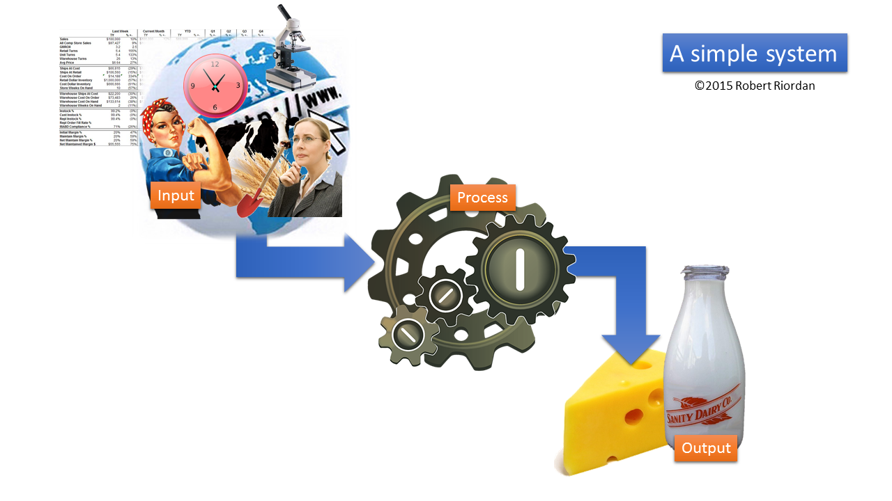

# Preamble (in which we introduce some critical context)

Intro to ICT for the average smart person

=======

Source: http://xkcd.com/1352/

***Welcome to our course!***

Order: 
1. Information
2. Communication
3. Technology

Themes that will run through this text and course:
- Are we talking data, information, knowledge or wisdom?
- Is this tangible or intangible?
- Does this (technology/service/data/etc.) either shrink input or grow output or both? If neither, is there any value to it? No.
- If the purpose of business is to solve problems at an increasing rate (which creates real prosperity), then does the product/service/technology under consideration solve a "real" problem? And a real problem is one that either shrinks input or grows output. Think about this one. See the [McKinsey article](http://www.mckinsey.com/insights/corporate_social_responsibility/redefining_capitalism)
- What is the value proposition (definition required) for using this tech, app, service, etc.? If there is no VP, why bother? Is this same as point above? 
- Does this product/service/technology lead to a sustainable competitive advantage? This is developed in the context of both PERSONAL CA (such as FB  or Twitter, etc. - needs to be carefully defined but this definition will allow us to understand the corporate part) and CORPORATE CA (easier to define but must also encompass not-for-profit and government services).

###Data, information, knowledge and wisdom

In the beginning, there was nothing. Or perhaps even less than that. Maybe *negative* nothing? But of course negative nothing is something, so maybe not. In any event, at the instant of the Big Bang (with apologies to Sheldon *et al*), there was instantly something. It was the very first binary data. Nothing, then everything. Zero then one. Off became on. Dark turned to light. Up or down became possible. In became different from out. You get the picture. And so it began. Nothing, then something. We've been collecting and interpreting data ever since. 

This section is lengthy (or at least lengthier that you might think is necessary from this side), but with good reason. We really need to carefully consider the differences (and there are many) between data, information, knowledge and wisdom, and also their intricate and intimate interrelationships, in order to understand what Information Systems (or the broader term that I prefer - *Information and Communication Technology*) really is and what impact it has on our private and public lives. So let's go.

First, let's carefully define what each means in its own right, then we can examine the hierarchy that evolves when discussing them in the context of decision making.

####Data

The excellent website (or service, really) [visualthesaurus.com](http://visualthesaurus.com) shows the visualisation, above, of the lookup term "Data" once expanded.  

The interpretation of the visual goes as follows: 
* A solid line between two terms denotes a relationship between a meaning and a word. Thus the term at the distal (far) end of a solid line can be used to express the meaning of the defined word.
* A dashed line indicates a "type of" relationship. Thus the term at the distal end of a dashed line indicates that this construct is a type of the term at the proximal (near) end of the dashed line. So "accounting data" is a "type of" data. Self-evident, really. 
* A dashed red line (not shown in this visual but appearing in others below) indicates an opposite. So a red line appearing between the terms "near" and "far" would indicate that they are a negation of each other. 

The Visual Thesaurus defines data as: "A collection of facts from which conclusions may be drawn." Hold onto this definition as we further analyse the complex relationship between data and information.

The visual here implies (states, really) that data and information are synonymous; that they can be used to describe each other, and thus that they are equal. My definition, which clears up some of the ambiguity in the terms data and information, is: *Data is pre-information; potential information; a collection of one or more facts, figures or measurements of some entity whether tangible or not*.

The online [Business Dictionary](http://businessdictionary.com) defines data as: 
1. Information in raw or unorganized form (such as alphabets, numbers, or symbols) that refer to, or represent, conditions, ideas, or objects. Data is limitless and present everywhere in the universe. See also information and knowledge.
2. Computers: Symbols or signals that are input, stored, and processed by a computer, for output as usable information.

I respectfully disagree, ever so slightly, with these two definitions. Specifically, in definition #1, the word *information* should not appear. Rather, both definitions should begin with the words in the second definition, specifically that data are "symbols and codes" or indeed drawings or sounds or signs or even facial expressions that carry within them the *potential* for information but not information *per se*.  Data is raw and lacks context. A stream of digits, for example. Note the definition of information below, from the same source, and note that one of the necessary elements of information is that it be presented within a context that gives it meaning. Take a look. 

[[Interested?](http://www.businessdictionary.com/definition/data.html#ixzz3MHuObnyk)]

###Information

Our dictionary source offers that information is "Data that is:  
1. accurate and timely, 
2. specific and organized for a purpose, 
3. presented within a context that gives it meaning and relevance, and 
4. can lead to an increase in understanding and decrease in uncertainty.

Information is valuable because it can affect behavior, a decision, or an outcome. For example, if a manager is told his/her company's net profit decreased in the past month, he/she may use this information as a reason to cut financial spending for the next month. A piece of information is considered valueless if, after receiving it, things remain unchanged. For a technical definition of information see information theory."

[Interested? http://www.businessdictionary.com/definition/information.html#ixzz3MHy9CeAf]

Clearly, data cannot be both information and data at the same time, if the requirement for information is that it must be organised and in context. Data doesn't doesn't have the potential to change things (or lead to change). Data that can be understood, interpreted and put into context leads to information, which can effect changes in behaviour and can facilitate decision making. Now we're getting somewhere.

Wolfram|Alpha [describe this] has these 5 definitions of Information. Below are the 4 that bear n our study here:

1. a message received and understood 
2. knowledge acquired through study or experience or instruction 
3. noun a collection of facts from which conclusions may be drawn 
4. noun (communication theory) a numerical measure of the uncertainty of an outcome 

### Entropy
In the physical sciences the entropy associated with a situation is a measure of the degree of randomness. The second law of thermodynamics states that entropy always increases in the universe. High entropy equals high level of chaos.  [Me: Thus for decision making, entropy is the enemy. Entropy is "junk on the signal." It thwarts our efforts to make sense of a data transmission  and to translate data into information. While entropy and chaos and superfluous data provide richness in terms of the volume of signal being sent, they are useless in the context of seeking pointed, surgical, targeted information to answer a specific question.] From the yellow Curator article. 

####Information Theory
And let's look at Information Theory while we're here. Our dictionary defines it as:
"Basic data communication theory that applies to the technical processes of encoding a signal for transmission, and provides a statistical description of the message produced by the code. It defines information as choice or entropy and treats the 'meaning' of a message (in the human sense) as irrelevant. Proposed together by the US mathematicians Claude Shannon (1916-2001) and Warren Weaver (1894-1978) in 1949, it focuses on how to transmit data most efficiently and economically, and to detect errors in its transmission and reception."

[[Interested?](http://www.businessdictionary.com/definition/information-theory.html#ixzz3MJ2TuS7s)]

###Knowledge

How about knowledge? The Visual Thesaurus cogently defines knowledge as: "The psychological result of perception and learning and reasoning." So this definition explicitly excludes machines from having the capacity to "know" something since it refers to a "psychological result." Pity...  

But let's look at this visual for a second. NOte how rich it is. Note how many node are of interest to us here. 

Further, the first definition from our Business Dictionary source is preferred over the second as it refers to the context of Law. Here's what's on offer:

"General: Human faculty resulting from interpreted information; understanding that germinates from [the] combination of data, information, experience, and individual interpretation. Variously defined as, "Things that are held to be true in a given context and that drive us to action if there were no impediments" (Andre Boudreau). "Capacity to act" (Karl Sweiby). "Justified true belief that increases an entity's capacity for effective action" (Nonaka and Takeuchi). "The perception of the agreement or disagreement of two ideas" (John Locke). In an organizational context, knowledge is the sum of what is known and resides in the intelligence and the competence of people. In recent years, knowledge has come to be recognized as a factor of production (see knowledge capital) in its own right, and distinct from labor."

[Interested? http://www.businessdictionary.com/definition/knowledge.html#ixzz3MI6pmqhU]

###Wisdom

So data is useless unless in a context, which allows it to become information. Information drives decisions, in he rich context of previous information. Collected information becomes knowledge, which begets wisdom - the ability to pass judgment on the previous three.  HAMMER THIS HOME.

[Google NGRAMS Maybe put this stuff below in the section on Big Data or elsewhere? Commented out now.]

So clearly we have a pathway beginning with data, which, in context, provides information. Information in its collectivity, provides wisdom. With information and wisdom (which I define as the intersection of collective information with enough experience to allow for sufficient clarity such that one can critique the process of marshaling data to information and then be prepared to engineer the environment so as to lead to better information in the future)...

 
###What is technology?
Wikipedia offers that Technology is "...the collection of tools, including machinery, modifications, arrangements and procedures used by humans." Note the breadth of this definition. How do we understand "tools" in this context, for example? It is not inconceivable that a tool could be a hammer, a cell phone, a traffic signal, a spoken language or even applied mathematics. So technology is broad indeed. 
[[Interested?](http://bit.ly/139Y25z)]

The online [Business Dictionary](http://businessdictionary.com) also takes a broad view, and delineates categories and taxonomies. They write that technology is "The purposeful application of *information* in the design, production, and utilization of goods and services, and in the organization of human activities." (emphasis added)

Further, they provide the following detail, while splitting the taxonomy into two additive (presumably) sub-categories. Thus technology can be either tangible (can be touched, seen, etc.) or intangible (not physical -- as in the sense of services). Further, they rank three levels of interaction between technology and the matter and forces with which it interacts. So we can have tangible technology that is either high, medium or low, with the same three levels for intangible. They write that: "Technology is generally divided into five categories:
1. Tangible (blueprints, models, operating manuals, prototypes) [can be touched, take up space, etc.]
2. Intangible (consultancy, problem-solving, and training methods) [do not exists in the physical realm; do not exist until consumed...]
3. High (entirely or almost entirely automated and intelligent technology that manipulates ever finer matter and ... powerful forces) [a space shuttle]
4. Intermediate (semiautomated partially intelligent technology that manipulates refined matter and medium level forces) [an eCommerce algorithm] 
5. Low (labor-intensive technology that manipulates only coarse or gross matter and weaker forces) [a shovel]"

[[Interested?](http://bit.ly/1GsH5SO)]

But the online Oxford Dictionary takes a much narrower view, *viz*.: "The application of scientific knowledge [the logical progeny of information] for practical purposes, especially in industry. [For example,] advances in computer technology [or] recycling technologies." 

We will take this narrower view of technology in this book, partly because we just don't have the time to consider all the nuances that the broader scope suggests. So when we consider technology, and specifically information and communication technology, we be constraining ourselves to the narrow realm where engineering, science (both natural and social) and business realities intersect and interact with the systems that are in use in our modern society, with an eye to whether or not they are creating value by either reducing input or enhancing output.

[[Interested?](http://bit.ly/1z0JHX3)]

### Context

VT definitions for context: 
1. Language that helps to determine its interpretation 
2. the set of facts or circumstances that surround a situation or event

Let's start right away by considering the notion of *context*. Here's what the online Oxford Reference has to say about it:

"Most broadly, any frame of reference or framework within which something is perceived, produced, consumed, communicated, interpreted, or otherwise experienced, or which is seen as relevant to the description or analysis of any phenomenon."

[Interested? http://bit.ly/1ITF5oD]

The salient parts of that definition refer to the "frame of reference" within which "something is perceived, consumed... or otherwise experienced..." Why so important? Because context is everything. 

Think for the moment of the process of getting ready for an adventure outside the home. Going to school maybe, or work, or just for a walk. Think about the decisions that need to be made, focusing on what to wear. If you're like me, you have a range of things to put on your back -- but what to wear today? First level of decision, likely made with no conscious thought whatsoever, is to consider the season. Thus the largest "context" in which the decision of what to wear outside is provided by considering the season. 

Next in line is likely the general state of the weather, within the broader context of season. If it's winter, is is sunny and cold, or is a blizzard raging? Finally, just hearing that it's cold outside is insufficient context. As we know, being good Canadians, there's Winnipeg or Ottawa cold and then there's Vancouver or Niagara cold. Not the same thing at all. *Ergo* "cold" is a qualitative and relative measure, relative to the context of where one currently finds oneself and it doesn't much help us to decide on apparel. Being cold in summer is quite different from being cold in winter.

Let's just drive this home by considering temperature in a little more detail. In determining what to wear, we might be wise to consult a weather service. Navigate to a website or click a "Follow me" app (and isn't the function of 'follow me weather' to provide the context of where one is currently located?) on your device or switch on the TV and select the weather channel (where the context will already have been chosen for you because the weather channel "knows" to where the sigla is being sent, thus provides the proper geo-context for you). Normally the current temperature is the most salient factor, thus we might find a large **20** prominently displayed on the screen. Not to put too fine a point on it, and you've likely already caught on, but *20 degrees* indicates entirely different weather in Buffalo as opposed to just across the lake in Toronto - even on a day where the objective weather is exactly the same in both cities. That's owing to, obviously, the scale of temperature being measured in Fahrenheit in Buffalo and Celsius in Toronto. Twenty F is below freezing in Buffalo whereas 20 C is t-shirt weather in Toronto. So the context of location, regardless of what the weather actually is, is important. Context drives interpretation.

Oxford also offers us the following (lightly edited and reduced for better understanding in this context...):

### Context of Situation
1. Malinowski [eminent anthropologist] coined this phrase in 1923 to refer to the cultural context of use in which an utterance was located; furthermore, ‘the whole way of life’ (cultural context) had to be borne in mind in interpreting an utterance.
2. For Firth, all of the circumstances in which a spoken utterance occurs that are relevant in making sense of it. He emphasized that meaning is context-dependent.
3. For Halliday, extralinguistic circumstances of use that influence the linguistic form of an utterance: not only the social and physical setting, but also such factors as social relationships, the nature of the medium, the task, and the topic. He proposed that there is a systematic relationship between ‘typical’ situations and the types of language employed within them (see also register).

[Interested? http://bit.ly/1yUkLQU]

###Meaning

Furthermore, what does meaning mean? Oxford to the rescue.

"Whatever it is that makes what would otherwise be mere sounds and inscriptions into instruments of communication and understanding. The philosophical problem is to demystify this power, and to relate it to what we know of ourselves and the world."

[Interested? http://bit.ly/1GoQwmb]

###Setting

1. The historical period and geographical region forming the backdrop for a narrative in any medium.
2. The context of a particular social episode in everyday life:
3. The background for a depicted figure or subject in a visual representation:
4. One of three key elements in advertising formats, the others being product and person.

[Interested? http://bit.ly/1svp03G]

###Situatedness

1. The dependence of meaning (and/or identity) on the specifics of particular sociohistorical, geographical, and cultural contexts, social and power relations, and philosophical and ideological frameworks, within which the multiple perspectives of social actors are dynamically constructed, negotiated, and contested. 
2. Social situatedness: the notion that the development of individual intelligence is dependent on its embedding in a social (and cultural) context. It derives from the work of Vygotsky in the 1920s.

[Interested? http://bit.ly/1svpjLY]

Figure 1: The flow of data into contextual information to decision and wisdom

In Figure 1 we see illustrated how existing and new data (d) flow into a new context (c) where existing and new information (i) is produced and combined with information contained in existing contexts to produce a new context. This new 'mashup' provides the necessary ingredients for a new decision. The decision, in turn, creates new information, which feeds wisdom which, in its accumulated glory, washes back over any new or even existing context. The creation of knowledge is thus a dynamic, fluid and constant activity for living organisms and inanimate entities such as organisations. 

###The two contributions of ICT

Each of these Oxford References relate to the others and to ICT in the sense that there are arguably (and I will argue thusly in this text) but two impacts that ICT can have in our individual daily lives and in the functions of every for-profit or not-for-profit enterprise, public institution and social endeavour. The first is as **Input Reducer** and the second function is that of **Output Enhancer**. Both will be fleshed out and returned to repeatedly throughout this text. 

We need to examine IS in terms of its ability to provide the necessary rich array of data which allow decisions to be made with relative certainty. Context is something that is, as referenced above, "dynamically constructed, negotiated, and contested." In order to make fewer errors in our decision-making endeavours, we need as much context (the rich backdrop of facts, figures and shared understandings) as possible.

So context becomes the frame of reference within which we narrow the error bands around our decisions. Context is everything, and IS provides, or can provide, rich context. We will be examining context repeatedly in this book, because context is what drives understanding, and understanding drives decision making and good decisions are something that we all, as actors in both public and private scenarios, need to make. 

###Process
First, let's define what a process is, as the two functions of ICT impact all processes.

Figure 2. A simple process

A simple process, any process, has only three pieces. First, input is required. Once input is present, a process then transforms input into output. That's it. Input --> Process --> Output. All three are necessary. No process without input, no input without process, no input and process without something coming out the other side. Make sure to understand that a process also requires a trigger: something to set it in motion. Processes don't just start of their own volition (if they had any) or momentum. Something must spur them into action. 

For now, in examining the ICT task of input reducer, we need to examine this function in terms of its ability to provide the necessary rich array of data which allow decisions to be made with relative certainty. Context is something that is, as referenced above, "dynamically constructed, negotiated, and contested." In order to make fewer errors in our decision-making endeavours (and thus to reduce the amount of input necessary to produce the same output), we need as much context (the rich backdrop of facts, figures and shared understandings) as possible. We need to know what data means (see Information Architecture below). We need to be able to put data into context to create actionable information. 

So context becomes the frame of reference within which we narrow the error bands around our decisions. Context is everything, and ICT has the potential to provide very rich context indeed. We will be examining context repeatedly in this book, because context is what drives understanding, and understanding drives decision making and good decisions are something that we all, as actors in both public and private scenarios, need to make. 

Information systems can not only distribute that scarcest of all commodities - knowledge - but can create knowledge and understanding in socially equitable ways. It is argued that the purpose of business is to solve problems, leading to a better social situation for as many humans as possible. It is only as a by-product of problem solving that profits are generated. One could assume, however, that problems for which no profit can be made won't be solved. Unless, of course, we consider the rapidly-expanding social economy and the not-for-profit sector.

Idea: To reduce error around decisions - messages (data) need to be specific even though entropy = information richness - so the questions have to be specific and this is Information Architecture - specifying what questions you will need to answer and then architecting your data collection to fit - including usability and findability. This is not to say that exploratory research isn't valuable but just that if there are specific questions you need answered you'd better carefully design your data-gathering tools in order to answer those questions. 

[Nov 24 rr]
Data architects are responsible for organizing data and ensuring that all data standards and controls including definitions, [golden]sources, data models and data quality monitoring are fully managed. Robert Half projects a 7.2 per cent salary increase in this space. Annual salaries will be around $119,750 to $164,750.

Read more: http://www.itworldcanada.com/slideshow/6-hot-it-positions-in-2015#ixzz3K0CPYgOI 
or visit http://www.itworldcanada.com for more Canadian IT News 

From <http://www.itworldcanada.com/slideshow/6-hot-it-positions-in-2015> 

###Information Architecture

A whole book!!! http://books.google.ca/books?id=2d2Ry2hZc2MC&printsec=frontcover&dq=information+architecture&hl=en#v=onepage&q&f=false

From Wikipedia: (http://en.wikipedia.org/wiki/Information_architecture#CITEREFRosenfeldMorville1998)

Information architecture has somewhat different meanings in different branches of IS or IT [source is the IA Google book above]:

1. The structural design of shared information environments.
2. The art and science of organizing and labeling web sites, intranets, online communities, and software to support findability and usability.
3. An emerging community of practice focused on bringing principles of design and architecture to the digital landscape.
4. The combination of organization, labeling, search and navigation systems within websites and intranets.
5. Extracting required parameters/data of Engineering Designs in the process of creating a knowledge-base linking different systems and standards.

Idea: To reduce error around decisions - messages (data) need to be specific even though entropy = information richness - so the questions have to be specific and this is Information Architecture - specifying what questions you will need to answer and then architecting your data collection to fit. This is not to say that exploratory research isn't valuable but just that if there are specific questions you need answered you'd better carefully design your data-gathering tools in order to answer those questions. 

[Nov 24 rr]
Data architects are responsible for organizing data and ensuring that all data standards and controls including definitions, [golden]sources, data models and data quality monitoring are fully managed. Robert Half projects a 7.2 per cent salary increase in this space. Annual salaries will be around $119,750 to $164,750.

Read more: http://www.itworldcanada.com/slideshow/6-hot-it-positions-in-2015#ixzz3K0CPYgOI 

##Debate
The difficulty in establishing a common definition for "information architecture" arises partly from the term's existence in multiple fields. In the field of systems design, for example, information architecture is a component of enterprise architecture that deals with the information component when describing the structure of an enterprise.

While the definition of information architecture is relatively well-established in the field of systems design, it is much more debatable within the context of online information systems (i.e., websites). Andrew Dillon refers to the latter as the "big IA-little IA debate". In the little IA view, information architecture is essentially the application of information science to web design which considers, for example, issues of classification and information retrieval. In the big IA view, information architecture involves more than just the organization of a website; it also factors in user experience, thereby considering usability issues of information design.

##The role of IA
Information architecture is a specialized skill set that interprets information and expresses distinctions between signs and systems of signs. More concretely, it involves the categorization of information into a coherent structure, preferably one that the intended audience can understand quickly, if not inherently, and then easily retrieve the information for which they are searching. The organization structure is usually hierarchical, but can have other structures, such as concentric or even chaotic. Typically this is required in activities such as library systems, content management systems, web development, user interactions, database development, computer programming, technical writing, enterprise architecture, and critical system software design. Information architecture originates, to some degree, in the library sciences. Many schools with library and information science departments teach information architecture.

In the context of information systems design, information architecture refers to the analysis and design of the data stored by information systems, concentrating on entities, their attributes, and their interrelationships. It refers to the modeling of data for an individual database and to the corporate data models that an enterprise uses to coordinate the definition of data in several (perhaps scores or hundreds) distinct databases. The "canonical data model" is applied to integration technologies as a definition for specific data passed between the systems of an enterprise. At a higher level of abstraction, it may also refer to the definition of data stores.

[[Interested?](http://books.google.ca/books?id=-wy3RhKoWWQC&printsec=frontcover&source=gbs_ge_summary_r&cad=0#v=onepage&q&f=false)]

[[Intersted?](http://books.google.ca/books?id=cZlYmQrnTMwC&printsec=frontcover&source=gbs_ge_summary_r&cad=0#v=onepage&q&f=false)]

[[Interested?](http://books.google.ca/books?id=Tp40QFGCU2sC&printsec=frontcover&source=gbs_ge_summary_r&cad=0#v=onepage&q&f=false)]

1. In the physical sciences the *entropy* associated with a situation is a measure of the degree of randomness. The second law of thermodynamics states that entropy always increases in the universe. High entropy equals high level of chaos.  [Me: Thus for decision making, entropy is the enemy. Entropy is "junk on the signal." It thwarts our efforts to make sense of a data transmission and to translate data into information. While entropy and chaos and superfluous data provide richness in terms of the volume of signal being sent, they are useless in the context of seeking pointed, surgical, targeted information to answer a specific question.] From the yellow Curator article. 
 

###Internet usage

