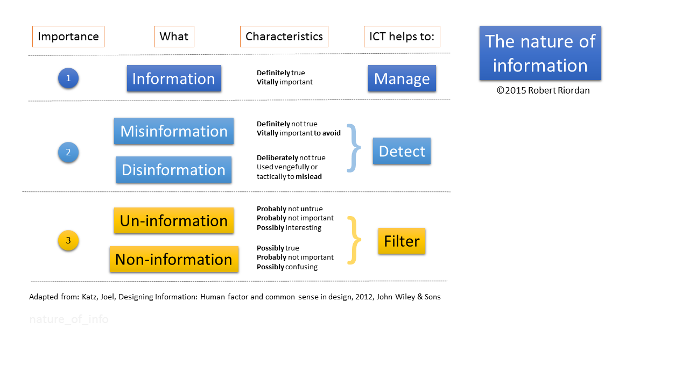
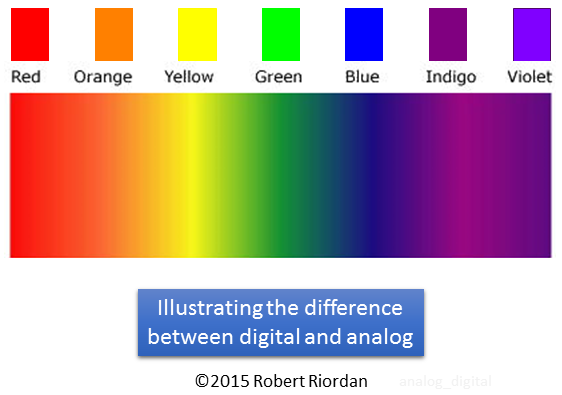
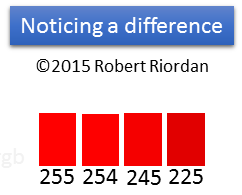

# Chapter 2
## In which we dig in a little deeper

Visual Thesaurus definitions for context: 

1. Language that helps to determine its interpretation 
2. The set of facts or circumstances that surround a situation or event

Let's start right away by considering the notion of _context_. Here's what the online Oxford Reference has to say about it:

"Most broadly, any frame of reference or framework within which something is perceived, produced, consumed, communicated, interpreted, or otherwise experienced, or which is seen as relevant to the description or analysis of any phenomenon."

[Interested? http://bit.ly/1ITF5oD]

The salient parts of that definition refer to the _frame of reference_ within which _something is perceived, consumed... or otherwise experienced..._ Why so important? Because context is everything. 

Think for the moment of the process of getting ready for an adventure outside the home. Going to school maybe, or work, or just for a walk. Think about the decisions that need to be made, focusing on what to wear. If you and I are even somewhat alike, then you have a range of things to put on your back -- but what to wear today? First level of decision, likely made with no conscious thought whatsoever, is to consider the season. Thus the season provides the largest _context_ in which is made the decision of what to wear outside. Season sets the broad parameters. 

Next in line is likely the general state of the weather, within the broader context of season. If it's winter, is it sunny and cold, or is a blizzard raging? Finally, just hearing that it's cold outside is insufficient context. As we know, being good Canadians, there's Winnipeg or Ottawa cold and then there's Vancouver or Niagara cold. Not the same thing at all. *Ergo* "cold" is a qualitative and relative measure, relative to the context of where one currently finds oneself and it doesn't much help us to decide on apparel. Summer cold is a different beast entirely from winter cold.

Let's just drive this home by considering temperature in a little more detail. In determining what to wear, we might be wise to consult a weather service. Navigate to a website or click a _Follow me_ app such as www.theweathernetwork.com (and isn't the function of 'follow me weather' to provide the context of where one is currently located?) on your device or switch on the TV and select the weather channel (where the context will already have been chosen for you because the weather channel _knows_ to where the signal is being sent, thus provides the proper geo-context for you). Normally the current temperature is the most salient factor, thus we might find a large **20** prominently displayed on the screen. Not to put too fine a point on it, and you've likely already caught on, but *20 degrees* indicates entirely different weather in Buffalo as opposed to just across the lake in Toronto - even on a day where the objective weather is nearly exactly the same in both cities. That's owing to, obviously, the scale of temperature being measured in _Fahrenheit_ in Buffalo and _Celsius_ in Toronto. Twenty F is below freezing in Buffalo whereas 20 C is t-shirt weather in Toronto. So the context of location, regardless of what the weather actually is, is important. Context drives interpretation. Context makes information out of data and allows us to make decisions.

Oxford also offers us the following (lightly edited and reduced for better understanding in this context... hahaha):

### Context of Situation
1. Malinowski [eminent anthropologist] coined this phrase in 1923 to refer to the cultural context of use in which an utterance [something said by someone] was located; furthermore, ‘the whole way of life’ (cultural context) had to be borne in mind in interpreting an utterance.
2. For Firth, all of the circumstances in which a spoken utterance occurs that are relevant in making sense of it. He emphasized that meaning is _context-dependent._ [emphasis added]
3. For Halliday, extralinguistic circumstances of use that influence the linguistic form of an utterance: not only the social and physical setting, but also such factors as social relationships, the nature of the medium, the task, and the topic. He proposed that there is a systematic relationship between ‘typical’ situations and the types of language employed within them.

[Interested? http://bit.ly/1yUkLQU]

###Situatedness
An interesting corollary of context is the notion of _situatedness_. Oxford Reference defines it partly as:

“The dependence of meaning (and/or identity) on the specifics of particular sociohistorical, geographical, and cultural contexts, social and power relations, and philosophical and ideological frameworks, within which the multiple perspectives of social actors are _dynamically constructed, negotiated, and contested._” [emphasis added] 

 [[Interested?](http://bit.ly/1svpjLY)]

Ever told someone “You had to be there.” as a reply to the question “What are you guys talking about?” Then you appreciate _context_. The interpretation of a message or communication is dependent on the situation in which and to which the communication refers. Imagine how many ways a simple word like “Yes” or “No” could be interpreted when you consider situational variables such as voice inflection, facial expression, volume and the length of utterance of the speaker, to name but a few. There are literally dozens of possible interpretations or meanings for a simple word, depending on the context in which the word was uttered. 

Oxford suggests that context is dynamically constructed, negotiated and contested. I would add that people navigate and interpret context all the time. We are social actors who are continuously jostling for a position of advantage among our peers and contemporaries. This is the human condition. Our question is “Can machines be empowered to do the same?” We’ll get there in our discussion. Hang on. 

###Meaning

How do we derive meaning from data or communication? Through context. Context provides meaning. But what does meaning mean? Oxford to the rescue.

"Whatever it is that makes what would otherwise be mere sounds and inscriptions into instruments of communication and understanding. The philosophical problem is to demystify this power, and to relate it to what we know of ourselves and the world."

[Interested? http://bit.ly/1GoQwmb]

What we _know_ of ourselves and the world is clearly _knowledge_.  From where comes knowledge?
Oxford offers the following (edited for applicability in context ;). Knowledge is:
1. **Facts, information**, and skills acquired by a person through **experience** or education; the theoretical or practical understanding of a subject
2. Awareness or familiarity gained by experience of a fact or **situation** 

http://www.oxforddictionaries.com/us/definition/american_english/knowledge
The important concepts are **bolded** in the definitions above. Let’s look at each in turn:
1.	Facts – facts can be thought of as data; simple measurements lacking context.
2.	Information – we dealt with information in Chapter 1, and how it is derived from data and then becomes transformed into potential action through context.
3.	Experience – experience is a synonym for context.
4.	Situation – also a synonym for context.
Where does this all fit in terms of business? 

### Context in business decisions
Figure LJLJ. A simple context

Examine Figure LJLJ from left to right. Imagine this as the first ever measurement of a phenomenon; the very first ever observation of data. The first day of a new business. It’s all brand new. View it as a process where _d_ (data) is the input and _K_ (knowledge) is the output. The only existing elements are measurements, which make the data tangible (length, for example, is a concept; 6 cm is tangible data representing length). 

The process begins as newly-measured data approach from outside the system and become understood in a _context_ where the data become _information_. This creation of new information allows a decision to be made, and decisions lead either to _action_ or _non-action_. Actions/non-actions lead to results, the measurement of which yield new data (observations) in the context of that situation, which leads ultimately to knowledge (experienced gained by observing the effects of the action/non-action in this particular context). This is a theory of how data are transformed into knowledge. 

There are thus two contexts in each chain from data to knowledge. There’s the initial context with the decision and action attendant upon it, then there’s the context resulting of the action. This is how we gain knowledge. We experiment. We make decisions and we see what happens. But there is a much richer model to come, wherein we benefit from our accumulated knowledge and our observations of context. Hang on. 

It’s important to note that information only occurs within a context, and each context is, by definition, unique. There can be similar contexts, contexts that share traits with other, like contexts, but each context is itself unique. The universe ticks ahead and an infinite array of things change with each tick. Thus it’s important to bring as much data as possible to bear on a particular context, as it will never happen again. Everything changes in the ticking of the clock. We will return to this.  

Let’s re-examine our clothing decision in light of this theory.  

Imagine a new friend has just landed from Mars. Or Alberta. No preconceived notions (previous contexts) upon which to base a choice of clothing, and you’re not there to help. Our Martian friend has an objective measurement of temperature (temperature being a universal measure), is aware of their location (earth) and of the star date, and finally that they have a certain tolerance for temperature (and operating range as it were). What to wear? 

In this knowledge-acquisition model, there is _always_ context. The context in this case is that there precious little data upon which to base the information required to choose what to wear. So in this context, our Martian friend simply chooses to wear nothing (no action) while going for a stroll to the mall.  Turns out it’s February 10th and we’re in Ottawa. Tad chilly. The result of this decision to take no dressing action is that our friend experiences intense cold against an unprotected body and that cold is outside the sustainable operating range of a healthy Martian. Their body measures the temperature and the effects of that temperature and this data, in the new context, becomes information. When this information in this context, in association with the information provided by the initial context is stored, it becomes knowledge. 

The nugget of knowledge for our green friend is that at this temperature on this date in this location taking no action to protect oneself from cold is potentially damaging.  Bingo. Knowledge and a new context upon which to base further action. Walk through this scenario again with this knowledge but with the same Martian in the same situation on July 10. What would the process look like? 

To answer this question, we must move to the more elaborated model of knowledge acquisition (or decision making if you prefer). See figure 1.

Figure 1: The flow of data into contextual information to decision, action and knowledge

In Figure 1 we see illustrated how the process of measurement (m), whether conscious or not, provides a value for a new piece of data (d), which in combination with existing. Measured data (whether newly-measured or previously measured) flows into a new context (circle) where new information (green) is produced when combined with knowledge available through feedback from previous contexts (green arrow). This new 'mashup' provides the necessary ingredients for a new decision. The decision begets some results, whether through action or non-action, which, in turn, creates new information in this new context. This new information in turn feeds knowledge from observing the outcome of the action. This new knowledge (K), in combination with prior knowledge, in its accumulated glory, washes back over any new context. The creation of knowledge is thus a dynamic, fluid and constant activity for living organisms and inanimate entities such as organisations. 

Knowledge creation can be seen as a system, with the four main entities identified by coloured ovals in Figure 1. On the left is _Input_, flowing into _Process_, which produces _Output_ which is fed back into the system as _Input_ to the continuous process of knowledge production and acquisition. 

## Important takeaways
* 
A context is a new and unique (non-reoccurring) circumstance created out of the intersection of existing and new data and existing knowledge gained from previous contexts. It can only occur once. No two contexts are alike.

* 
Since contexts (and thus decisions emanating from the information created in them) are unique, it is critical to provide the optimal amount of data and knowledge as input to the context. There is no substitute for accurately-measured data and accumulated knowledge. 

* 
Decision quality is a function of reducing error around the decision outcome. Accumulated knowledge from previous contexts and of the outcomes of decisions attendant upon them will reduce error. Better decisions are the result. If you have _seen stuff like it before_ and have _observed the outcome_ you are clearly in a better position to make a more accurate prediction of the future. 

* 
Knowledge is accumulated by observing results in context. 

* 
Wisdom is knowing how and when to use it…

###Information Theory
Our business dictionary defines Information Theory as:
"Basic data communication theory that applies to the technical processes of encoding a signal for transmission, and provides a statistical description of the message produced by the code. It defines information as choice or entropy and treats the 'meaning' of a message (in the human sense) as irrelevant. Proposed together by the US mathematicians Claude Shannon (1916-2001) and Warren Weaver (1894-1978) in 1949, it focuses on how to transmit data most efficiently and economically, and to detect errors in its transmission and reception."

[[Interested?](http://www.businessdictionary.com/definition/information-theory.html)]

To really understand Shannon and Weaver (and a guy named Weiner), we need to look at little more deeply into the theory of information.

### Entropy
From another relatively old (1998) but still [excellent piece](http://www.sveiby.com/articles/Information.html), we find an introduction to the concept of _entropy_. 

“In the physical sciences the entropy associated with a situation is a measure of the degree of randomness. The second law of thermodynamics states that entropy always increases in the universe. High entropy equals high level of chaos.”  

Thus for decision making, entropy is the enemy. Entropy is _junk on the signal._ It thwarts our efforts to make sense of a data transmission  and to translate data into information. While entropy and chaos and superfluous data provide richness in terms of the volume of signal being sent, they are useless in the context of seeking pointed, surgical, targeted information to answer a specific question.

But this (rather dense – too much so to make it an [Interested?] link) article also raises some crucial points. Specifically that “The word information is derived from Latin _informare_ which means "give form to". […] Most people tend to think of information as disjointed little bundles of 'facts'. In the Oxford definition of the word it is connected both to knowledge and communication. […] The way the word information is used can refer to both 'facts' in themselves and the transmission of the facts.”

The author continues.

"Information according to Cybernetics 

The double notions of information as both facts and communication are also inherent in one of the foundations of information theory: cybernetics introduced by Norbert Wiener (1948). The cybernetic theory was derived from the new findings in the 1930s and 1940s regarding the role of bioelectric signals in biological systems, including the human being. The full title was: 'Cybernetics or Control and Communication in the Animal and the Machine'. Cybernetics was thus attached to biology from the beginning.

"Wiener introduces the concepts, amount of information, entropy, feedback and background noise as essential characteristics of how the human brain functions. [...]

"The notion of the amount of information attaches itself very naturally to a classical notion in statistical mechanics: that of entropy. Just as the amount of information in a system is a measure of its degree of organisation, so the entropy of a system is a measure of its degree of disorganisation. [...]

"What is information and how is it measured? Wiener defines it as a probability: One of the simplest, most unitary forms of information is the recording of choice between two equally probable simple alternatives, one or the other is bound to happen - a choice, for example, between heads and tails in the tossing of a coin. We shall call a single choice of this sort a decision. If we then ask for the amount of information in the perfectly precise measurement of a quantity known to lie between A and B [...] then the number of choices made and the consequent amount of information is infinite. [...] The quantity that we here define as amount of information is the **negative** of the quantity usually defined as entropy in similar situations." (article author’s bold)

Thus for Weiner, information is organisation and entropy is its opposite - disorganisation. The author goes on to write that "Wiener`s view of information is thus that it contains a structure that has a meaning. It will be seen that the processes which lose information are, as we should expect, closely analogous to the processes which gain entropy. 

"Information is from its conception attached to issues of decisions, communication and control, by Wiener. System theorists build further on this concept and see information as something that is used by a mechanism or organism, a system which is seen as a 'black box', for steering the system towards a predefined goal. The goal is compared with the actual performance and signals are sent back to the sender if the performance deviates from the norm. This concept of negative feedback has proven to be a powerful tool in most control mechanisms, relays etc."

We then muddy the already cloudy water by introducing an opposing viewpoint, that of Claude Shannon, an eminent information scientist working at AT&T (the telephone people) in the 1950s. The author writes:

"The other scientist connected with information theory is Claude Shannon. He was a contemporary of Wiener and as an AT&T mathematician he was primarily interested in the limitations of a channel in transferring signals and the cost of information transfer via a telephone line. He developed a mathematical theory for such communication in The Mathematical Theory of Communication, (Shannon & Weaver 1959). Shannon defines information as a purely quantitative measure of communicative exchanges."

So Shannon wasn't interested as much in _what_ was communicated as much as he was in the _volume_ or _occurrence_ of communication. It's not _what_ for him, but _that_. The author continues:

"[...] based on Shannon it does not matter whether we are communicating a fact, a judgement or just nonsense. Everything we transmit over a telephone line is 'information'. The message 'I feel fine' is information, but 'ff eeI efni' is an equal amount of information."

Note that the message (we cannot say the 'intended message' as we do not know what the intention of the sender was when sending it) 'I feel fine' is contained in the jibberish 'ff eeI efni', but there are other possible combinations of letters and spaces that would yield other equally viable messages in this context. For Shannon there is information richness in this disorganisation. The potential for many messages means there is more raw information in the message. As we will see, for business, this isn't a good thing. 

In Shannon's defence, the author goes on to write that "Shannon is said to have been unhappy with the word 'information' in his theory. He was advised to use the word 'entropy' instead, but entropy was a concept too difficult to communicate so he remained with the word. Since his theory concerns only transmission of signals, Langefors (1968) suggested that a better term for Shannon’s information theory would therefore perhaps be 'signal transmission theory'."

But we have a problem here. How can one theorist describe information as organisation and another describe it as disorganisation? The article continues with:

“Weaver, explaining Shannon’s theory in the same book: Information is a measure of one’s freedom of choice in selecting a message. The greater this freedom of choice, the greater the information, the greater is the uncertainty that the message actually selected is some particular one. Greater freedom of choice, greater uncertainty greater information go hand in hand.”

Here comes the contradiction…

“There is thus one large - and confusing - difference between Shannon and Wiener. Whereas Wiener sees information as negative entropy, i.e. a 'structured piece of the world', Shannon's information is the same as (positive) entropy. This makes Shannon's ‘information’ the opposite of Wiener's ‘information’."

For Shannon, the content of a message (which he calls _information_ but which I call _potential_ information) is a function of volume. The bigger the message, the greater the information content. Shannon was a telephone company engineer, interested only in _that_ a message was sent and not _what_ message was sent. Shannon did not care _what_ people were talking about on the phone but only _that_ they were talking. The volume of data transmitted was more important than the actual content. 

And this makes sense if you think about it, from the point of view of a telephone conversation. Imagine you are in a phone call. In the background, you have music playing loud enough for the other party to hear. While the music is not part of the conversation, _per se_, it becomes an element of the message being sent from you to the other party. It’s background, but contributes to the richness of the signal. 

Thus for Shannon, the more _entropy_ (disorder – as in background music), the more disorganisation (lack of focus) and therefore the more _potential_ decisions could be made as a result of the message. If the background music was too loud, for example, the ‘intended message’ might become garbled or unintelligible. This is not helpful for us in business, where we rely on _targeted_ almost _surgical_ messaging in order to make decisions that result in positive outcomes. 

Weiner, on the other hand, saw information as _negative entropy_, or positive organisation with structure, interpretability, less equivocation and noise and more certainty. This is the kind of message that business requires. Straightforward and to the point. No guessing about the information content of a data stream.  Weiner is our man. We care both _what_ is being messaged and _that_ messaging is occurring. 

Entropy is the friend of information _volume_ but the enemy of good _decision making_. In business, we need to keep the junk off the signal. Entropy is to be avoided. Structure is valued. Clean communication is the goal. Understanding is critical.

So maybe here goes the information, disinformation, uninformation, etc. stuff? Leading to context and lots of data to get good information.

Below is an infographic of sorts, showing the five faces of information. The faces and their characteristics are from a (highly recommended) 2012 book (Katz, Joel, Designing Information: Human factor and common sense in design, 2012, John Wiley & Sons) by Joel Katz.  

I have grouped the five info types into three, then ranked them in terms of their importance to us as students of business, but moreover, added a column delineating the approach taken by ICT to the challenge of how to deal with each group. Let’s begin at the bottom, and explain each in turn. 

As we walk our way up the scale, consider the context to be that our firm is examining the results of an online poll asking visitors to an outside website to rate our products. The results have been summarised by a third-party firm and released at a press conference sponsored by one of our biggest competitors. This could be damaging to us. The opinions of visitor’s to the website have been measured with the online survey and the raw data have been contextualised by the polling firm and our competitor has provided their own spin. 

Though the data have transformed into information in the context of our competitor’s survey and the analysis by the polling firm, for us, it’s still raw data. In order to make a decision whether to act on the release of the data, we need to put it in our own unique context. The data are inbound per Figure LJLJ. 

We need to contextualise the input data in order to create information sufficient to decide on an action. Here we go. 

Non-information is described by Katz as being possibly true (though perhaps untrue), probably unimportant (perhaps we can ignore it) and/or possibly confusing (not well enough explained to allow understanding). The ICT approach is likely to monitor and filter. If the information is deemed to be of no impact, the ICT response could be to filter it out and remove it from consideration by our company. If deemed potentially relevant, we might conclude that the survey results pass the non-information test, thus we retain it and move up the ladder. A simple system might be in place to monitor news services looking for keywords in order to decide whether to move the status of the news item to alert. News items that fail to meet a minimum criteria would likely be filtered out.

Next up is un-information as we move into the orange zone of importance. This is a curious category indeed, but information here is more important (potentially more impactful) than is non-information. It’s slightly up the _fudge scale_ in terms of perceived truth, going from only ‘possibly true’ to ‘probably not untrue’ -- talk about a fine distinction! It remains probably unimportant, but has moved up the scale from confusing to possibly interesting. We have then, in this situation, some input data that is at least potentially interesting to us. The ICT response might be to alert the firm to the existence of the information, and wait for a knowledge worker to decide whether the information warrants escalation or disposal.

Assuming the knowledge worker decided on escalation, a further determination is necessary in order to decide on a response. We need to go up another rung on the ladder into the critical red zone. This is where context and information become critical. 

The first category in the red zone is ‘disinformation’, which Katz characterised as _deliberately not true_ and very likely used tactically to intentionally mislead those consuming it. This information might well have been fabricated by our competitor to cast us in a bad light. This activity might well be illegal, and could be quite damaging to our reputation. In this context, we will want to take some action to protect ourselves. An ICT response could be to provide data to counter the disinformation and disseminate it to our stakeholders in order to protect ourselves from damage.

If analysis determines that the information released by our competitor is not deliberately untrue and damaging, it might well be ‘misinformation’, described as definitely not true and important to avoid, in the sense that if the information were considered to be true (and it is, in fact, not true) any actions taken in the context of it being true would be inappropriate in the least and damaging at worst. This information is toxic and needs to be corrected before inappropriate action is taken by some party believing it to be true. Some party such as our customers! The ICT response could be to provide true information to counter the false assertions, which could be provided to our customers through various actions (email, Twitter, Facebook, etc.) made possible by stored electronic customer service records. 

If the information is deemed to not be untrue (ergo, it’s true) then we move to the last level in the scale, information. The release is deemed to contain a true representation of our customers’ opinions of our products and, if released by our competitor, the results must be saying either something bad about us or something good about them. Whichever, the information is true and action must be taken to deal with the fallout. 

We can now provide a little more depth in terms of contextualisation and the role if ICT in the process. Examine Figure LLJJ below. It’s the same figure as LJLJ above, but with the ICT contributions overlaid on each element. 
Figure LLJJ. Context with ICT contribution

We begin on the input end of the context system. And we begin pre-data, with measurement. ICT provides several critical functions in terms of data measurement, beginning at the very basic level of sensing. ICT systems are deployed in a myriad of situations as sensors, simply sitting quietly waiting for something to happen. Sensing a phenomenon is often akin to measuring it – a photon of light passing through a pane of glass, for example, causes the count of photons to tick up by one. An RFID (Radio Frequency Identification) system on a gas pump continuously broadcasts its presence, waiting for a customer’s matching key fob transmitter to spring to life in response to the signal. Then all kinds of commerce can happen. Sensors are everywhere from parking lots to soft drink dispensers and from washrooms to smartphones. And more and more sensors are being deployed all the time. We will return to this topic a number of times as we move forward. 

ICT can of course measure things independent of sensing. A scale on the highway measures truck weight in the same way a bathroom scale measures our own weight, minus the incessant upward bias that shows our weight as stupidly heavy… oops. Did I say that out loud? A radar gun measures speed. An elevator measures weight and will refuse to close its doors if overloaded. An accelerometer measures the speed of our finger swipe on a tablet computer in order to throw a lance at an invading barbarian in protecting your virtual village from attack. All are measurement devices. In performing this function, ICT systems must be engineered to respect the most critical tenet of measurement: accuracy and its constituents trueness and precision and including _reproducibility_. Once measured, the same data must yield the same results using the same technique. This is sometimes referred to as _reliability_.

Note also that the infographic implies that a lot of data just _fly right by_ the system. This is true in two ways. First, data that has no known bearing on the current context has no value in this system. Data about vehicle mileage, no matter how accurate and reliable, simply cannot add to the context of a decision about the marketing of disposable diapers. It’s simply not in the domain. So this data flies right by. 

Next, however, is a more important aspect. There is simply so much data being generated every micro-second (5 EB every two days) that it’s impossible to capture it all in either it’s incredible volume or in a timely manner, so vast is the big data cloud. But what’s important is to get as much of it as possible in order to create the richest context and thus the most informed information, leading to the most accurate decisions about a course of action. 

This leads to the next contribution of ICT to the area of decision making and knowledge acquisition, that of dealing with the data itself. ICT systems can act as data filters, enforcing rules about relevancy, domain, accuracy, currency and reliability. Data can be fed through systems and sorted, filtered, combined and then stored for later use. When required, systems can assemble data into useable formats and send them on their way to other systems for analysis. This is referred to as _marshalling_. ICT can store, slice and dice and then assemble and transport data. A one-stop shop for management. 

Moving to the area at the boundary between input and processing, we enter one of the most crucial and hot areas in ICT: context and information creation. We’ve spend some considerable time talking about context and information in context, so all we need here is to elaborate on how ICT contributes to and supports the activities in this area. 

ICT helps to contextualise a decision challenge through providing measured data to contribute to the richness of the solution space. ICT can accomplish this in a number of ways, and not just the traditional method of storing and marshalling legacy data (such as spreadsheet data of last year’s sales, for example), but by providing real-time, synchronous data representing the current situation. Things such as identity authentication (allowing you to be in a certain place at a certain time based on either what you have – such as a password or a fingerprint – or what know, such as a password. Your location in time and space can be known and broadcast. And if it can be done for you, it can be done for others. Thus random gatherings of persons in a particular place and time can be sensed and utilised in setting a context. Even simple things such as GPS and cell tower triangulation can locate you and others. This can facilitate all sorts of crowd-related things such as pop-up retail, policing and research into facility location. It’s also how things such as geo-fencing are accomplished. Geo-fencing has been in the spotlight lately with the use (and abuse) of a little app named Yik-Yak. 

[Interested in geo-fencing?]

ICT can not only use and broadcast your location, it can also sense activity – what you’re doing. If your location puts you on the water, ICT can make a reasonable guess about what you’re doing, and the error around deciding what it might be can be reduced by examining (measuring) your velocity, for example. Systems can sense and determine lots of activity you might be engaged in. It can therefore authorise you, based on location, time and activity, to perform certain tasks, such as allow you access to a secure facility or allow you to take rental materials or even rental vehicles. Unattended attendants. How cool.

Finally (but by no means exhaustively), ICT can contextualise your activities based on your or others’ previous pattern of activity at a time and place. A system might also make some reasonable guesses (though systems don’t guess things) about what you are likely to no _next_ and anticipate and allow you to discover available services in your vicinity that are appropriate and appealing to you. Walking through the park? Ever rented a canoe to go paddling in the pond before? How about a little text message from Joe’s Canoe Rental? This stuff, called m-commerce facilitated by location services, is popping up all over. And we’ve just scratched the surface here. 

Context is _the single biggest thing happening in ICT today_. The proliferation of sensors, so tiny and innocuous, is facilitating measurement at such a fine scale and with such sensitivity that soon we’ll have what one author referred to as _liquid information_ (see below). Context is so compelling, let’s take a few more minutes with it. 

The distinction between the concepts of _analog_ (or _analogue_) and _digital_ is important here. Analog is nature. Analogue is the subtle curves and continuous change we witness all around us where sometimes it’s difficult to tell where one thing ends and another begins. Consider colour. In figure ECC below, we see colour represented in two different ways, and discrete swatches and then, below that, as a continuum of the visible colours of the rainbow. 

Figure ECC. Illustrating the difference between analog and digital

Difference between an integer and a real (float). Redundant nervous system. Etc… 

We can (most of us – some people suffer with some form of colour blindness) easily discern the difference between red and orange, or orange and yellow from among the boxes in the top row of the figure. And we could equally easily point to a green region or a blue region in the continuous strip of colour underneath. The challenge become specifying the point at which yellow becomes green or indigo, violet. At what point does yellow disappear and become green as we move left to right? The continuous nature of the colour strip makes it difficult to pinpoint anything, in fact. 

The colours in the upper box are represented using a specific method of reproducing colour called the RGB method, standing for _R_ed, _G_reen, _B_lue, two of the three primary colours. All colours, using this method, are produced as a function of mixing more or less of each of these three on a scale from 0 to 255. So the RGB for the colour red is 255, 0, 0. The maximum red (255) and no green or blue. Green is 0, 255, 0 and blue, 0, 0, 255. Of course there are plenty of shades and hues between these values and indigo and violet off the right end of the spectrum are entities unto themselves. 

It doesn’t matter how this or other colour representation methods (CMYK, Pantone, etc.) actually work. What matters is that the continuous colour scale represented by the visible spectrum of the rainbow can be _sampled_ and _digitised_ such that we can work with it in a discrete way. The RGB scale itself produces hues between which the naked eye could not discern. I challenge you to distinguish an RGB of 255, 0, 0 from 254, 0, 0. It would take an expensive display device to even reproduce that difference. The point being that, at some point or resolution, a digital representation becomes just as good as the analog one. It’s just as good because we can’t tell the difference. Take a look at Figure JP below. 

Figure JP. Subtle differences in RGB

We refer to this concept as _granularity_. And we will return to granularity shortly. 

A very old but again ever so interesting and current site (www.liquidinformation.org) has this (http://www.liquidinformation.org/ana_digi_liqui.html) to offer on the apparently spurious distinction between digital and analog as it pertains to ICT. First some definitions:
 
**Analog**: an•a•log ‘a mechanism in which data is represented by continuously variable physical quantities’ (from Merriam Websters) Date: 1948
**Digital**: dig•i•tal ‘of or relating to the fingers or toes . using calculation by numerical methods or by discrete units’ (from Merriam Websters) Etymology: Latin digitalis Date: circa 1656
**Liquid**: liq•uid ‘flowing freely like water. having the properties of a liquid : being neither solid nor gaseous. smooth and unconstrained in movement’ (from Merriam Websters) Date: 14th century. 
  
  
“We have been brought up to believe that there is a total distinction, a wall of separation between digital and analog: The world is smooth and continuous; analog whereas computers are operating on discrete, black & white separate units; they are digital. And the twain shall never meet. 

“Well you know, it just ain't so. Imagine a couple of small grains of sand. Digital, separate, discrete. Now add a couple more. And a couple more. Millions more. Billions. 

  
And you have a beach. An analog, a smooth continuous environment. 

  
Everyday home and office computers, with capacities to manipulate literally billions of bits literally billions of times a second […] have gone the way of the grains of sand and are definitively not just digital anymore. And they have the potential to become more than analog. 

  
They have the potential to become, and make us, liquid.”

 
So the question for us is: At what point does digital become analog? At what point (threshold) does it matter to us? At what point can we detect? What resolution is important for us? This is like decimal place precision. How many decimals is it necessary to report in a table before the next number becomes useless? This introduces the notion of  Just-noticeable Difference or JND. And of course a just-noticeable difference is context dependent (isn’t everything?). The point, however, is that at some point in the digitisation of analogue phenomena, the distinction disappears and we can’t tell the difference. 

[Interested?] http://apps.usd.edu/coglab/WebersLaw.html

[Interested?] Weber-Fechner law of Just-noticeable Difference (jnd): http://en.wikipedia.org/wiki/Just-noticeable_difference
 

We might also want to consider the concept of _resolution_. The resolution of a sensor is the smallest change it can detect in the quantity that it is measuring. 

[Interested?] (http://en.wikipedia.org/wiki/Sensor)

Figure JJLL. Exformation as context

Sir John A. and exformation here...

Then there's [1974](http://blog.hemmings.com/index.php/2012/07/10/hemmings-find-of-the-day-1974-buick-electra-225-limited/). 

This is all about context or maybe EXFORMATION? I think exformation. 

