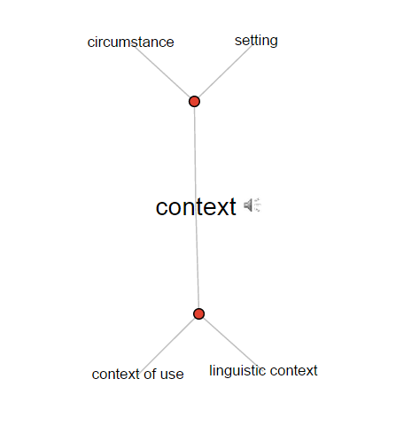

# Chapter 2
## All about context

Visual Thesaurus definitions for context: 

1. Language that helps to determine its interpretation 
2. The set of facts or circumstances that surround a situation or event

Let's start right away by considering the notion of _context_. Here's what the online Oxford Reference has to say about it:

"Most broadly, any frame of reference or framework within which something is perceived, produced, consumed, communicated, interpreted, or otherwise experienced, or which is seen as relevant to the description or analysis of any phenomenon."

[Interested? http://bit.ly/1ITF5oD]

The salient parts of that definition refer to the _frame of reference_ within which _something is perceived, consumed... or otherwise experienced..._ Why so important? Because context is everything. 

Think for the moment of the process of getting ready for an adventure outside the home. Going to school maybe, or work, or just for a walk. Think about the decisions that need to be made, focusing on what to wear. If you and I are even somewhat alike, then you have a range of things to put on your back -- but what to wear today? First level of decision, likely made with no conscious thought whatsoever, is to consider the season. Thus the season provides the largest _context_ in which is made the decision of what to wear outside. Season sets the broad parameters. 

Next in line is likely the general state of the weather, within the broader context of season. If it's winter, is it sunny and cold, or is a blizzard raging? Finally, just hearing that it's cold outside is insufficient context. As we know, being good Canadians, there's Winnipeg or Ottawa cold and then there's Vancouver or Niagara cold. Not the same thing at all. *Ergo* "cold" is a qualitative and relative measure, relative to the context of where one currently finds oneself and it doesn't much help us to decide on apparel. Summer cold is a different beast entirely from winter cold.

Let's just drive this home by considering temperature in a little more detail. In determining what to wear, we might be wise to consult a weather service. Navigate to a website or click a _Follow me_ app such as www.theweathernetwork.com (and isn't the function of 'follow me weather' to provide the context of where one is currently located?) on your device or switch on the TV and select the weather channel (where the context will already have been chosen for you because the weather channel _knows_ to where the signal is being sent, thus provides the proper geo-context for you). Normally the current temperature is the most salient factor, thus we might find a large **20** prominently displayed on the screen. Not to put too fine a point on it, and you've likely already caught on, but *20 degrees* indicates entirely different weather in Buffalo as opposed to just across the lake in Toronto - even on a day where the objective weather is nearly exactly the same in both cities. That's owing to, obviously, the scale of temperature being measured in _Fahrenheit_ in Buffalo and _Celsius_ in Toronto. Twenty F is below freezing in Buffalo whereas 20 C is t-shirt weather in Toronto. So the context of location, regardless of what the weather actually is, is important. Context drives interpretation. Context makes information out of data and allows us to make decisions.

Oxford also offers us the following (lightly edited and reduced for better understanding in this context... hahaha):

### Context of Situation
1. Malinowski [eminent anthropologist] coined this phrase in 1923 to refer to the cultural context of use in which an utterance [something said by someone] was located; furthermore, ‘the whole way of life’ (cultural context) had to be borne in mind in interpreting an utterance.
2. For Firth, all of the circumstances in which a spoken utterance occurs that are relevant in making sense of it. He emphasized that meaning is _context-dependent._ [emphasis added]
3. For Halliday, extralinguistic circumstances of use that influence the linguistic form of an utterance: not only the social and physical setting, but also such factors as social relationships, the nature of the medium, the task, and the topic. He proposed that there is a systematic relationship between ‘typical’ situations and the types of language employed within them.

[Interested? http://bit.ly/1yUkLQU]

###Situatedness
An interesting corollary of context is the notion of _situatedness_. Oxford Reference defines it partly as:

“The dependence of meaning (and/or identity) on the specifics of particular sociohistorical, geographical, and cultural contexts, social and power relations, and philosophical and ideological frameworks, within which the multiple perspectives of social actors are _dynamically constructed, negotiated, and contested._” [emphasis added] 

 [[Interested?](http://bit.ly/1svpjLY)]

Ever told someone “You had to be there.” as a reply to the question “What are you guys talking about?” Then you appreciate _context_. The interpretation of a message or communication is dependent on the situation in which and to which the communication refers. Imagine how many ways a simple word like “Yes” or “No” could be interpreted when you consider situational variables such as voice inflection, facial expression, volume and the length of utterance of the speaker, to name but a few. There are literally dozens of possible interpretations or meanings for a simple word, depending on the context in which the word was uttered. 

Oxford suggests that context is dynamically constructed, negotiated and contested. I would add that people navigate and interpret context all the time. We are social actors who are continuously jostling for a position of advantage among our peers and contemporaries. This is the human condition. Our question is “Can machines be empowered to do the same?” We’ll get there in our discussion. Hang on. 

###Meaning

How do we derive meaning from data or communication? Through context. Context provides meaning. But what does meaning mean? Oxford to the rescue.

"Whatever it is that makes what would otherwise be mere sounds and inscriptions into instruments of communication and understanding. The philosophical problem is to demystify this power, and to relate it to what we know of ourselves and the world."

[Interested? http://bit.ly/1GoQwmb]

What we _know_ of ourselves and the world is clearly _knowledge_.  From where comes knowledge?
Oxford offers the following (edited for applicability in context ;). Knowledge is:
1. **Facts, information**, and skills acquired by a person through **experience** or education; the theoretical or practical understanding of a subject
2. Awareness or familiarity gained by experience of a fact or **situation** 

http://www.oxforddictionaries.com/us/definition/american_english/knowledge
The important concepts are **bolded** in the definitions above. Let’s look at each in turn:
1.	Facts – facts can be thought of as data; simple measurements lacking context.
2.	Information – we dealt with information in Chapter 1, and how it is derived from data and then becomes transformed into potential action through context.
3.	Experience – experience is a synonym for context.
4.	Situation – also a synonym for context.
Where does this all fit in terms of business? 

### Context in business decisions
Figure LJLJ. A simple context

Examine Figure LJLJ from left to right. Imagine this as the first ever measurement of a phenomenon; the very first ever observation of data. The first day of a new business. It’s all brand new. View it as a process where _d_ (data) is the input and _K_ (knowledge) is the output. The only existing elements are measurements, which make the data tangible (length, for example, is a concept; 6 cm is tangible data representing length). 

The process begins as newly-measured data approach from outside the system and become understood in a _context_ where the data become _information_. This creation of new information allows a decision to be made, and decisions lead either to _action_ or _non-action_. Actions/non-actions lead to results, the measurement of which yield new data (observations) in the context of that situation, which leads ultimately to knowledge (experienced gained by observing the effects of the action/non-action in this particular context). This is a theory of how data are transformed into knowledge. 

There are thus two contexts in each chain from data to knowledge. There’s the initial context with the decision and action attendant upon it, then there’s the context resulting of the action. This is how we gain knowledge. We experiment. We make decisions and we see what happens. But there is a much richer model to come, wherein we benefit from our accumulated knowledge and our observations of context. Hang on. 

It’s important to note that information only occurs within a context, and each context is, by definition, unique. There can be similar contexts, contexts that share traits with other, like contexts, but each context is itself unique. The universe ticks ahead and an infinite array of things change with each tick. Thus it’s important to bring as much data as possible to bear on a particular context, as it will never happen again. Everything changes in the ticking of the clock. We will return to this.  

Let’s re-examine our clothing decision in light of this theory.  

Imagine a new friend has just landed from Mars. Or Alberta. No preconceived notions (previous contexts) upon which to base a choice of clothing, and you’re not there to help. Our Martian friend has an objective measurement of temperature (temperature being a universal measure), is aware of their location (earth) and of the star date, and finally that they have a certain tolerance for temperature (and operating range as it were). What to wear? 

In this knowledge-acquisition model, there is _always_ context. The context in this case is that there precious little data upon which to base the information required to choose what to wear. So in this context, our Martian friend simply chooses to wear nothing (no action) while going for a stroll to the mall.  Turns out it’s February 10th and we’re in Ottawa. Tad chilly. The result of this decision to take no dressing action is that our friend experiences intense cold against an unprotected body and that cold is outside the sustainable operating range of a healthy Martian. Their body measures the temperature and the effects of that temperature and this data, in the new context, becomes information. When this information in this context, in association with the information provided by the initial context is stored, it becomes knowledge. 

The nugget of knowledge for our green friend is that at this temperature on this date in this location taking no action to protect oneself from cold is potentially damaging.  Bingo. Knowledge and a new context upon which to base further action. Walk through this scenario again with this knowledge but with the same Martian in the same situation on July 10. What would the process look like? 

To answer this question, we must move to the more elaborated model of knowledge acquisition (or decision making if you prefer). See figure 1.

Figure 1: The flow of data into contextual information to decision, action and knowledge

In Figure 1 we see illustrated how the process of measurement (m), whether conscious or not, provides a value for a new piece of data (d), which in combination with existing. Measured data (whether newly-measured or previously measured) flows into a new context (circle) where new information (green) is produced when combined with knowledge available through feedback from previous contexts (green arrow). This new 'mashup' provides the necessary ingredients for a new decision. The decision begets some results, whether through action or non-action, which, in turn, creates new information in this new context. This new information in turn feeds knowledge from observing the outcome of the action. This new knowledge (K), in combination with prior knowledge, in its accumulated glory, washes back over any new context. The creation of knowledge is thus a dynamic, fluid and constant activity for living organisms and inanimate entities such as organisations. 

Knowledge creation can be seen as a system, with the four main entities identified by coloured ovals in Figure 1. On the left is _Input_, flowing into _Process_, which produces _Output_ which is fed back into the system as _Input_ to the continuous process of knowledge production and acquisition. 

## Important takeaways
* 
A context is a new and unique (non-reoccurring) circumstance created out of the intersection of existing and new data and existing knowledge gained from previous contexts. It can only occur once. No two contexts are alike.

* 
Since contexts (and thus decisions emanating from the information created in them) are unique, it is critical to provide the optimal amount of data and knowledge as input to the context. There is no substitute for accurately-measured data and accumulated knowledge. 

* 
Decision quality is a function of reducing error around the decision outcome. Accumulated knowledge from previous contexts and the of outcomes of decisions attendant upon them will reduce error. Better decisions are the result. If you have _seen stuff like it before_ and have _observed the outcome_ you are clearly in a better position to make a more accurate prediction of the future. 

* 
Knowledge is accumulated by observing results in context. 

* 
Wisdom is knowing how and when to use it…

Figure LLJJ. Context with ICT contribution

What ICT does for you here...

Figure JJLL. Exformation as context

Sir John A. and exformation here...
Then there's [1974](http://blog.hemmings.com/index.php/2012/07/10/hemmings-find-of-the-day-1974-buick-electra-225-limited/). This is all about context or maybe EXFORMATION? 

HTTP://XKCD.COM/1519/

HTTP://IMGS.XKCD.COM/COMICS/VENUS.PNG

PERMANENT LINK TO THIS COMIC: HTTP://XKCD.COM/1513/

IMAGE URL (FOR HOTLINKING/EMBEDDING): HTTP://IMGS.XKCD.COM/COMICS/CODE_QUALITY.PNG

###Internet usage

