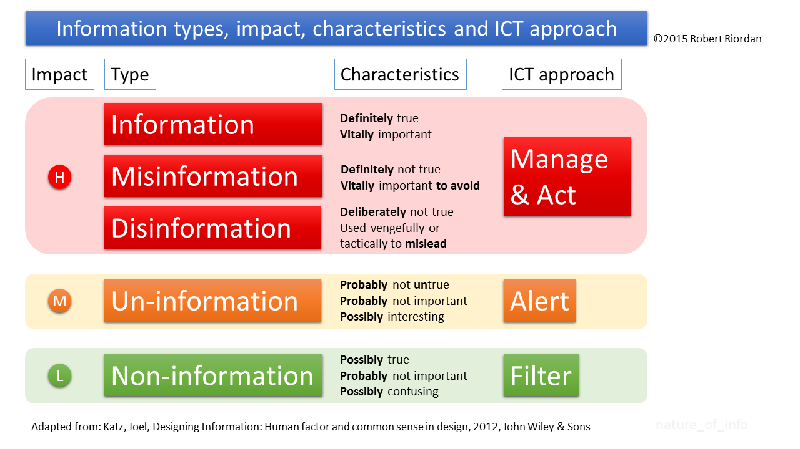
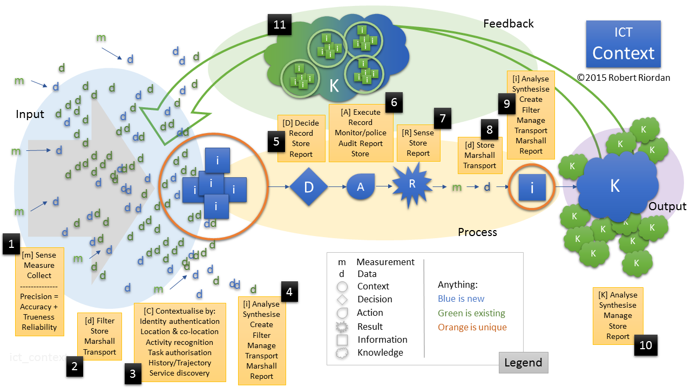
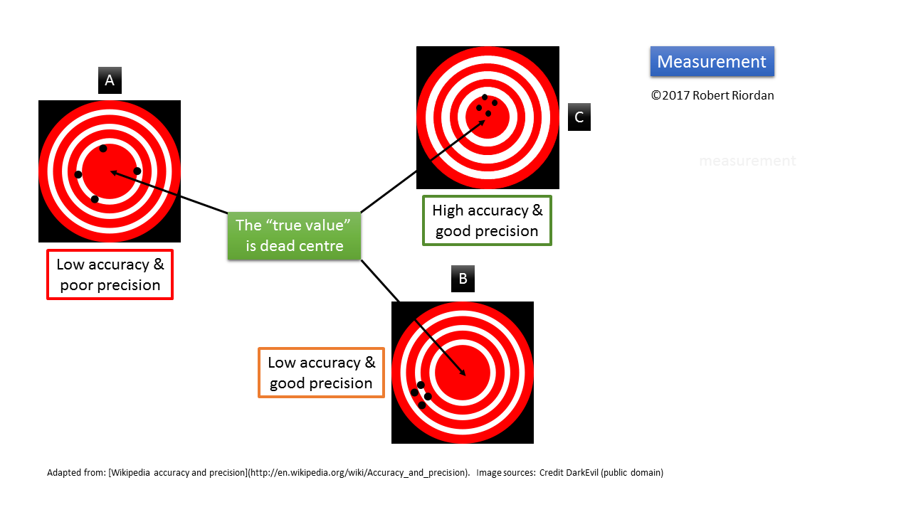
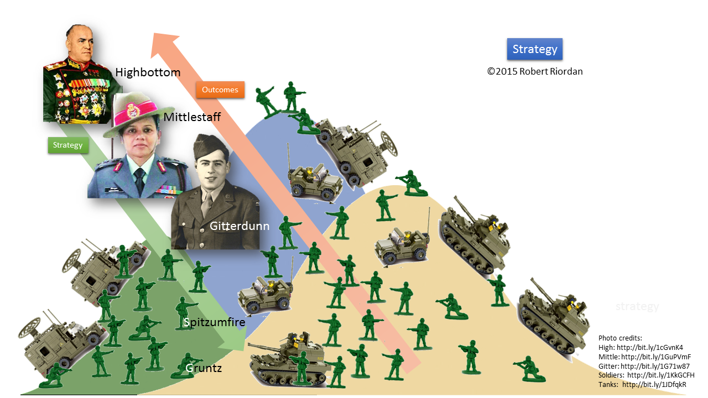

# Chapter 2
## In which we dig in a little deeper

We begin this chapter by stating unequivocally that computers have historically done a lousy job with _context_. They have been unable to understand, process and make sense of the nuanced detail of our lives and our interactions with each other and with our environment. Why? Because they have struggled with _knowledge_. They have struggled to _learn_ in the way that humans learn. They have not been able to generalise either from the specific to the general or from the general to the specific. They have been unable to observe a piece of art and decide if they _like_ it or not or even, until very recently, to quantify its characteristics. They struggle with deciding if a painting were a Picasso, a Monet or a Da Vinci. 

Those kind of tasks -- appreciating beauty, creating music, writing poetry -- have been left to humans because computers lacked the ability to create and appreciate _context_. The can’t see the _bigger picture_. All this is changing. Read on.

The Visual Thesaurus definition for context reads, in part: 

1. Language that helps to determine its interpretation 
2. The set of facts or circumstances that surround a situation or event

Of the two definitions, the second is most important for us. I have written elsewhere that data are _facts_. Just pieces of unencumbered specifics, providing measurement outcome of some phenomenon. _Circumstance_, on the other hand, is a collection of facts which together frame the _situation_ or _condition_. It’s the _fact bath_ in which we continuously find ourselves. It’s all the stuff that happens _around_ an event at a place and time that give us the ability to weave a rich fabric of meaning around the event and allows us reduce the error around what’s happening in a particular setting. Here's what the online Oxford Reference has to say about context:

"Most broadly, any frame of reference or framework within which something is perceived, produced, consumed, communicated, interpreted, or otherwise experienced, or which is seen as relevant to the description or analysis of any phenomenon."

[Interested? http://bit.ly/1ITF5oD]

The salient parts of that definition refer to the _frame of reference_ within which _something is perceived, consumed... or otherwise experienced..._ Why so important? Because context is everything. As humans, we live in a contextual soup of signs, signals, impressions, facts and suspicions. Computers can’t quite figure us out. Yet.

So what is context?

Think for the moment of the process of getting ready for an adventure outside the home. Going to school maybe, or work, or just for a walk. Think about the decisions that need to be made, focusing on what to wear. If you and I are even somewhat alike, then you have a range of things to put on your back -- but what to wear today? First level of decision, likely made with no conscious thought whatsoever, is to consider the season. Thus the season provides the largest or highest level (most abstract) _context_ in which is made the decision of what to wear outside. Season sets the broad parameters. Fact: It’s cold in winter and hot in summer and spring and fall are a crap shoot. 

Next in line is likely the general state of the weather, within the broader context of season. If it's winter, is it sunny and cold or is a blizzard raging? Finally, just hearing that it's cold outside is insufficient context. As we know, being good Canadians, there's Winnipeg or Ottawa cold and then there's Vancouver or Niagara cold. Not the same thing at all. *Ergo* "cold" is a qualitative and relative measure, relative to the context of where one currently finds oneself. It doesn't much help us to decide on apparel. Summer cold is a different beast entirely from winter cold.

Consider further the tug-of-war between the Alberta Clipper and the Chinooks. Even being in Canada in the winter can cause wide swings in weather. 

Let's just drive this home by considering temperature in a little more detail. In determining what to wear, we might be wise to consult a weather service. Navigate to a website or click a _Follow me_ app such as www.theweathernetwork.com (and isn't the function of 'follow me weather' to provide the **context** of where one is currently located?) on your device or switch on the TV and select the weather channel (where a local context will already be provided because the weather channel _knows_ to where the signal is being sent and thus provides the proper geo-context for you). Normally the current temperature is the most salient factor, thus we might find a large **20** prominently displayed on the screen. Not to put too fine a point on it, and you've likely already caught on, but *20 degrees* indicates entirely different weather in Buffalo as opposed to just across the lake in Toronto - even on a day where the objective weather is nearly exactly the same in both cities. That's owing to, obviously, the scale of temperature being measured in _Fahrenheit_ in Buffalo and _Celsius_ in Toronto. Twenty F is below freezing in Buffalo whereas 20 C is t-shirt weather in Toronto. So the context of location, regardless of what the weather actually is, is important. Context drives interpretation. Context makes information out of data and allows us to make decisions.

###Situatedness
An interesting corollary of context is the notion of _situatedness_. Oxford Reference defines it partly as:

“The dependence of meaning (and/or identity) on the specifics of particular sociohistorical, geographical, and cultural contexts, social and power relations, and philosophical and ideological frameworks, within which the multiple perspectives of social actors are _dynamically constructed, negotiated, and contested._” [emphasis added] 

 [[Interested?](http://bit.ly/1svpjLY)]

Ever answered to someone “You had to be there.” in reply to the question “What’s so funny?” If so, then you appreciate _context_. The interpretation of a message or communication is dependent on the situation in which and to which the communication refers. Imagine how many ways a simple word like _Yes_ or _No_ could be interpreted when you consider situational variables such as voice inflection, facial expression, volume and the length of utterance of the speaker, emphasis on a particular word or even syllable, to name but a few. There’s an hilarious comedy skit by a Jewish comic in which he successively puts the emphasis on each word in the interrogative phrase “He said I should bring a gift?” and in so doing changes the interpretation of the phrase each time. Try it yourself: Emphasise the **bolded** word in each sentence below and note how the meaning attached to the phrase changes each time:
**He** said I should bring a gift?
He **said** I should bring a gift?
He said **I** should bring a gift?
He said I **should** bring a gift?
And so forth. 

There are literally dozens of possible interpretations or meanings for a simple word, depending on the context in which the word was uttered. Misreading the context of a situation can be a very serious matter. If someone has ever quoted you _out of context_ then you know what we’re talking about here. So subtle and so powerful is context that we must dynamically manage all our behaviours in order to be appropriate _in context_.

Oxford suggests that context is dynamically constructed, negotiated and contested. I would add that people navigate and interpret context all the time. We are social actors who are continuously jostling for a position of advantage among our peers and contemporaries. Such is the human condition. 

Our question in this section is “Can machines be empowered to do the same?” We’ll get there in our discussion. Hang on. 

###Meaning
How do we derive meaning from data or communication? Through interpreting data and facts in context. Context provides meaning for meaningless data. But what does _meaning_ mean? Oxford to the rescue.

"Whatever it is that makes what would otherwise be mere sounds […] into instruments of communication and understanding. The philosophical problem is to demystify this power, and to relate it to what we know of ourselves and the world."

[Interested? http://bit.ly/1GoQwmb]

What we _know_ of ourselves and the world is clearly _knowledge_.  But from where comes knowledge?
Oxford offers the following (edited for applicability in context ;). Knowledge is:
1. **Facts, information**, and skills acquired by a person through **experience** or education; the theoretical or practical understanding of a subject
2. Awareness or familiarity gained by experience of a fact or **situation** 

http://www.oxforddictionaries.com/us/definition/american_english/knowledge

The important concepts are **bolded** in the definitions above. Let’s look at each in turn:
1.	Facts – facts can be thought of as data; simple measurements lacking context.
2.	Information – we deal with information below, and how it is derived from data and then becomes transformed into potential action through context.
3.	Experience – come from observation of the results of actions, which flow from context.
4.	Situation – clearly a synonym for context.

This suggests a simple and general model of knowledge acquisition that applies to all creatures, great and small, that are faced with making decisions. But where does this all fit in terms of business? 

### Context in business decisions
Figure LJLJ. A simple context

Examine Figure LJLJ from left to right. Imagine this as the first ever measurement of a phenomenon in a state of complete _nescience_ (absence of knowledge); the very first ever occurrence of this data; perhaps the first day of a new business where everything is all brand new. View it as a system in the way we understand systems from the introductory chapter where _d_ (data) is the input and _K_ (knowledge) is the output. The only existing elements are measurements, which make the data tangible (length, for example, is a concept or a variable; 6 cm is tangible data and a fact representing the length of something being measured). 

There might well be a question or a challenge creating a strategy vacuum and drawing data into that question context. It’s also possible that exploratory research is driving the data initiative, as in “Let’s look at our data and see what it has to tell us.” with no particular agenda in mind. 

Regardless of what nudged the process into action (remember that systems need a trigger in order to start), the ensuing procedure is the same. The process begins as newly-measured data approach from outside the system and become understood in a _context_ where the data become _information_. This creation of new information allows a decision to be made, and decisions lead either to _action_ or _inaction_. Actions/inactions lead to results, the measurement of which yield new data (measured observations) in the context of that situation, which leads ultimately to knowledge (experienced gained by observing the effects of the action/inaction in this particular context). This is a general theory of how data are transformed into knowledge. 

There are thus two contexts in each chain from data to knowledge. There’s the initial context with the decision and action/inaction attendant upon it, then there’s the context resulting from the action/inaction. This is how we gain knowledge. We act or stand still. We experiment. We make decisions and we see what happens. But there is a much richer model to come, wherein we benefit from our accumulated knowledge and our observations of context. That’s the only real reason for any of this. To get better at what we do based on experience. Hang on. 

It’s important to note that information only occurs within a context, and each context is, by definition, unique. There can be similar contexts, contexts that share traits with other, but each context is itself unique. The universe ticks ahead and an infinite array of things change with each tick. Thus it’s important to bring as much data as possible to bear on a particular context, as it will never occur again. Everything changes in the ticking of the clock. We will return to this.  

Let’s re-examine our clothing decision in light of this theory.  

Imagine a new friend has just landed from Mars. Or Alberta. Our visitor needs to find food and has no preconceived notions (previous contexts) upon which to base a choice of clothing. Our Martian friend has an objective measurement of temperature (temperature being a universal concept and all living organisms are sensitive to temperature and have an _operating range_ outside of which they cannot function), is aware of their location (earth) and of the star date, and finally that they have a certain tolerance for temperature (this is accumulated knowledge). What to wear? 

In our knowledge-acquisition model, there is _always_ context. The context in this case is that there is precious little data upon which to base the information required to choose what to wear. So in this context, our Martian friend simply chooses to wear nothing (no action) while going for a stroll to the mall. Turns out today is February 10th and we’re in Ottawa. Tad chilly. The result of this decision to take no dressing action is that our friend experiences intense cold against an unprotected body and the outside temperature is outside the sustainable operating range of a healthy Martian. Their body measures the temperature and the effects of that temperature and this data, in the new context, becomes information. This information in this context, in association with the information provided by the initial context is stored, becomes knowledge. Now our friend has a bit of a bead on what to wear. They have gained some _knowledge_. 

The nugget of knowledge for our little green friend is that at this temperature on this date in this location taking no action to protect oneself from the elements is potentially damaging. Bingo. Knowledge and a new context upon which to base further action. Walk through this scenario again with this knowledge but with the same Martian in the same situation on July 10. What would the process look like? 

To answer this question, we must move to the more elaborated model of knowledge acquisition (or decision making if you prefer). See Figure LAJ.

Figure LAJ: The flow of data into contextual information to decision, action and knowledge

In Figure LAJ we see illustrated how the process of measurement (m), whether conscious or not, provides a value for a new piece of data (d), which in combination with existing, measured data (whether newly-measured or previously measured) flows into a new context (circle) where new information (green) is produced when combined with knowledge available through feedback from previous contexts (green arrow). This new 'mashup' provides the necessary ingredients for a new decision. The decision begets some results, whether through action or inaction, which, in turn, creates new information in this new context. This new information in turn feeds knowledge from observing the outcome of the action. This new knowledge (K), in combination with prior knowledge, in its accumulated glory, washes back over any new context. The creation of knowledge is thus a dynamic, fluid and constant activity for living organisms and inanimate entities such as organisations alike. 

###Schemata and knowledge acquisition
This model of knowledge acquisition is not inconsistent with, and may be seen as an extension of, the work done in the fields of Psychology and Cognitive Science in the area of _schemata_. Pioneering work by Bartlett, extended by Jean Piaget, (see the Interested? links below) postulates that people learn about and make sense of their work by building, modifying, extending and discarding mental models of how things work. A quick (and brutally naïve) explanation and example follows.

 The first premise necessary to accept if one subscribes to the schema notion of knowledge acquisition is that of _tabula rasa_, loosely translated and understood to mean _blank slate_ as in a blank chalk board in a classroom. As far back as Aristotle, the notion that humans are born with a blank slate mind has been popular. [Interested?]( http://en.wikipedia.org/wiki/Tabula_rasa) This _blank slate_ is written on, erased, altered and generally enhanced as humans grow and learn and acquire knowledge. So at the first encounter of a child with a dog, for example, the rudimentary schema of dog_ is created that inscribes the characteristics of the dog (a particular size creature with four legs, fur, a tail and a long snout of a nose, etc.) to the dog schema. A parent label the creature _dog_ and the kid is off to the races, able to recognise all manner of four-legged creatures forever more. But trouble looms…

Next, our fearless young dog expert encounters a cow. Slightly bigger, but hey, it’s got four legs, fur, a snout and a tail. Must be a dog. So our schema builder points to the cow and happily announces to their parents “Dog!” Nope, the parents correct, that’s a cow. New schema in order here. At the same time, it’s possible that a _super schema_ is also developed, this one encompassing the characteristics we know as _animal_ and containing the attributes “four legs, fur, tail, long snout” of which _dog_ and _cow_ are specific examples. _Dog_ might now have an encoded attribute for _size_ that would differentiate the dog from the cow based on size. But _calf_ and _pony_ and _puppy_  and _kitten_ present problems, necessitating further refinements of the existing schemata. We won’t even get into the difference between a house cat (and the colour variation) and the myriad of _jungle casts_. Learning can be frustrating. 

It is through continual exposure to new data and continual feedback based on decisions made emanating from that exposure that specific and actionable knowledge is created and stored. You can see that the notion of context fits nicely here (well maybe you can’t see yet, but I can and I hope you will come to an understanding of these principles as we progress). It is also very interesting to note the similarities between the schemas of cognitive psychology and the software development technique known as _Object-Oriented Programming_ (or OOP). I’ll try to remember to we’ll revisit that connection in the chapter on Systems Development… :)   

Knowledge acquisition (also referred to as the process of _Knowledge Engineering_) is also the biggest obstacle to creating _Artificial Intelligence_ (or AI). If we have time to fit that in somewhere, it will likely be in the final chapter on _Future Trends_. While we’re here, I also strongly recommend a course (or even picking up a book on the topic) in Cognitive Psychology for anyone interested in ICT, Marketing, Finance or Management. It’s so cool you might just fall in love.  

[Interested in schemas?]( http://en.wikipedia.org/wiki/Schema_(psychology))
[Interested in Knowledge Acquisition?]( http://www.wisegeek.com/what-is-knowledge-acquisition.htm)

Knowledge acquisition can be seen as a system, with the four main entities identified by coloured background ovals in Figure LAJ. On the left is _Input_, flowing into _Process_, which produces _Output_ which is fed back into the system as _Input_ to the continuous process of knowledge production and acquisition. 

## Important takeaways
* 
A context is a new, unique and non-reoccurring circumstance created out of the intersection of existing and new data and existing knowledge gained from previous contexts. It can only occur once. No two contexts are alike.

* 
Since contexts (and thus decisions emanating from the information created in them) are unique, it is critical to provide the optimal (note I didn’t write _maximal_ as too little data can be as confounding as too much data) amount of data and knowledge as input to the context. There is no substitute for accurately-measured data and accumulated knowledge. 

* 
Decision quality is a function of reducing error around the decision outcome. Accumulated knowledge from previous contexts and of the outcomes of decisions attendant upon them will reduce error. Better decisions are the result. If you have _seen stuff like it before_ and have _observed the outcome_ you are clearly in a better position to make a more accurate prediction of the future. 

* 
Knowledge is accumulated by observing results of action/inaction in context. 

* 
Wisdom is knowing how and when to use it…

###Information Theory
Our business dictionary defines Information Theory as:
"Basic data communication theory that applies to the technical processes of encoding a signal for transmission, and provides a statistical description of the message produced by the code. It defines information as choice or entropy and treats the 'meaning' of a message (in the human sense) as irrelevant. Proposed together by the US mathematicians Claude Shannon (1916-2001) and Warren Weaver (1894-1978) in 1949, it focuses on how to transmit data most efficiently and economically, and to detect errors in its transmission and reception."

[[Interested?](http://www.businessdictionary.com/definition/information-theory.html)]

To really understand Shannon and Weaver (and a guy named Weiner), we need to look a little more deeply into the theory of information.

### Entropy
From another relatively old (1998) but still [excellent piece](http://www.sveiby.com/articles/Information.html), we find an introduction to the concept of _entropy_. 

“In the physical sciences the entropy associated with a situation is a measure of the degree of randomness. The second law of thermodynamics states that entropy always increases in the universe. High entropy equals high level of chaos.”  

Thus for decision making, entropy is the enemy. Entropy is _junk on the signal or static on the line._ It thwarts our efforts to make sense of a data transmission  and to translate data into information. While entropy and chaos and superfluous data provide richness in terms of the **volume** of signal being sent, they are useless in the context of seeking pointed, surgical, targeted information to answer a specific question and to guide action.

But this (rather dense – too much so to make it an [Interested?] link) article also raises some crucial points. Specifically that “The word information is derived from Latin _informare_ which means "give form to". […] Most people tend to think of information as disjointed little bundles of 'facts'. In the Oxford definition of the word it is connected both to knowledge and communication. […] The way the word information is used can refer to both 'facts' in themselves and the transmission of the facts.”

The author continues.

“The double notions of information as both facts and communication are also inherent in one of the foundations of information theory: cybernetics introduced by Norbert Wiener (1948). The cybernetic theory was derived from the new findings in the 1930s and 1940s regarding the role of bioelectric signals in biological systems, including the human being. The full title was: 'Cybernetics or Control and Communication in the Animal and the Machine'. Cybernetics was thus attached to biology from the beginning.

"Wiener introduces the concepts, amount of information, entropy, feedback and background noise as essential characteristics of how the human brain functions. [...]

"The notion of the amount of information attaches itself very naturally to a classical notion in statistical mechanics: that of entropy. Just as the amount of information in a system is a measure of its degree of organisation, so the entropy of a system is a measure of its degree of disorganisation. [...]

Thus organisation of data yields … this seems contradictory. Explain this better! 

ALSO link this to less input more output theory for systems. Like more pure rock gives better ore. More clear cell transmission yields better understanding of the data in context. 

"What is information and how is it measured? Wiener defines it as a probability: One of the simplest, most unitary forms of information is the recording of choice between two equally probable simple alternatives, one or the other is bound to happen - a choice, for example, between heads and tails in the tossing of a coin. We shall call a single choice of this sort a decision. If we then ask for the amount of information in the perfectly precise measurement of a quantity known to lie between A and B [...] then the number of choices made and the consequent amount of information is infinite. [...] The quantity that we here define as amount of information is the **negative** of the quantity usually defined as entropy in similar situations." (article author’s bold)

Thus for Weiner, information is organisation and entropy is its opposite - disorganisation. The author goes on to write that "Wiener`s view of information is thus that it contains a structure that has a meaning. It will be seen that the processes which lose information are, as we should expect, closely analogous to the processes which gain entropy. 

"Information is from its conception attached to issues of decisions, communication and control, by Wiener. System theorists build further on this concept and see information as something that is used by a mechanism or organism, a system which is seen as a 'black box', for steering the system towards a predefined goal. The goal is compared with the actual performance and signals are sent back to the sender if the performance deviates from the norm. This concept of negative feedback has proven to be a powerful tool in most control mechanisms, relays etc."

I then muddy the already cloudy water by introducing an opposing viewpoint, that of Claude Shannon, an eminent information scientist working at AT&T (the US telephone people) in the 1950s. The author writes:

"The other scientist connected with information theory is Claude Shannon. He was a contemporary of Wiener and as an AT&T mathematician he was primarily interested in the limitations of a channel in transferring signals and the cost of information transfer via a telephone line. He developed a mathematical theory for such communication in The Mathematical Theory of Communication, (Shannon & Weaver 1959). Shannon defines information as a purely quantitative measure of communicative exchanges."

So Shannon wasn't interested in _what_ was communicated as much as he was in the _volume_ or _occurrence_ of communication. It's not _what_ for him, but _that_. The author continues:

"[...] based on Shannon it does not matter whether we are communicating a fact, a judgement or just nonsense. Everything we transmit over a telephone line is 'information'. The message 'I feel fine' is information, but 'ff eeI efni' is an equal amount of information."

Note that the message (we cannot say the 'intended message' as we do not know what the intention of the sender was when sending it) 'I feel fine' is contained in the gibberish 'ff eeI efni', but there may be other possible combinations of letters and spaces that would yield other equally viable messages in this context. For Shannon there is information richness in this disorganisation. The potential for many messages means there is more raw information in the message. As we will see, for business, this isn't a good thing. 

In Shannon's defence, the author goes on to write that "Shannon is said to have been unhappy with the word 'information' in his theory. He was advised to use the word 'entropy' instead, but entropy was a concept too difficult to communicate so he remained with the word. Since his theory concerns only transmission of signals, Langefors (1968) suggested that a better term for Shannon’s information theory would therefore perhaps be 'signal transmission theory'."

But we have a problem here. How can one theorist describe information as organisation and another describe it as disorganisation? The article continues with:

“Weaver, explaining Shannon’s theory in the same book: Information is a measure of one’s freedom of choice in selecting a message. The greater this freedom of choice, the greater the information, the greater is the uncertainty that the message actually selected is some particular one. Greater freedom of choice, greater uncertainty greater information go hand in hand.”

Here comes the contradiction…

“There is thus one large - and confusing - difference between Shannon and Wiener. Whereas Wiener sees information as negative entropy, i.e. a 'structured piece of the world', Shannon's information is the same as (positive) entropy. This makes Shannon's ‘information’ the opposite of Wiener's ‘information’."

For Shannon, the content of a message (which he calls _information_ but which I call _potential_ information) is a function of volume. The bigger the message, the greater the information content. Shannon was a telephone company engineer, interested only in _that_ a message was sent and not _what_ message was sent. Shannon did not care _what_ people were talking about on the phone but only _that_ they were talking. The volume of data transmitted was more important than the actual content. 

And this makes sense if you think about it, from the point of view of a telephone conversation. Imagine you are in a phone call. In the background, you have music playing loudly enough for the other party to hear. While the music is not part of the conversation, _per se_, it becomes an element of the message being sent from you to the other party. It’s background, but contributes to the richness of the signal. 

Thus for Shannon, the more _entropy_ (disorder – as in background music), the more disorganisation (lack of focus) and therefore the more _potential_ decisions could be made as a result of the message. If the background music was too loud, for example, the ‘intended message’ might become garbled or unintelligible. This is not helpful for us in business, where we rely on _targeted_ almost _surgical_ messaging in order to make decisions that result in positive outcomes. 

Weiner, on the other hand, saw information as _negative entropy_, or positive organisation with structure, interpretability, less equivocation and noise and more certainty. This is the kind of message that business requires. Straightforward and to the point. No guessing about the information content of a data stream.  

Weiner is our man. We care both _that_ messaging is occurring and _what_ is being messaged. But Shannon was an inspiring academic. You’ll see reference to him in the section on ASCII. 

[Interested?]( http://www.kerryr.net/pioneers/shannon.htm)

Entropy is the friend of _information volume_ but the enemy of good _decision making_. In business, we need to keep the junk off the signal. Entropy is to be avoided. Structure is valued. Clean communication is the goal. Understanding is critical.

Below is an infographic of sorts, showing the five faces of information. The faces and their characteristics are from a (highly recommended) 2012 book by Joel Katz entitled _Designing Information: Human factor and common sense in design_ (2012, John Wiley & Sons).  

I have grouped Katz’s five types into three, then ranked them in terms of their importance to us as students of business, but moreover, added a column delineating the approach taken by ICT to the challenge of how to deal with each group. Let’s begin at the bottom, and explain each in turn. 

As we walk our way up the scale, consider the context to be that our organisation is examining the results of an online poll asking visitors to a third-party website to rate the various products in our industry (let’s say it’s the toothpaste segment of the dental hygiene industry just to put a face on it). The results have been summarised by the polling firm and released at a press conference sponsored by one of our biggest competitors. This could be damaging to us. The opinions of visitor’s to the website have been measured with the online survey and the raw data have been contextualised by the polling firm and, worst of all, our competitor has provided their own spin. 

Though the data have been transformed into information in the context of our competitor’s survey and the analysis by the polling firm, for us, it’s still raw data. In order to make a decision whether to act on the release of the data, we need to put it in our own unique context. The data are inbound per Figure LJLJ. 

We need to contextualise the input data in order to create information sufficient to decide on an action. Here we go, starting from the bottom of the taxonomy. 

Non-information is described by Katz as being possibly true (thus perhaps untrue), probably unimportant (perhaps we can ignore it) and/or possibly confusing (not well enough explained or contextualised to allow understanding). The ICT approach is likely to monitor and filter. If the information is deemed to be of no impact, the ICT response could be to filter it out and remove it from consideration by our company. If deemed potentially relevant, we might conclude that the survey information passes the non-information test, thus we retain it and move up the ladder. Our organisation might have a simple system in place to monitor electronic news services and social media flows looking for keywords (our organisation’s name for example, and perhaps negative and positive words in the context). Such monitoring might allow the system to decide whether to move the status of the news item up the scale to alert. News items that fail to meet a minimum criteria would likely be filtered out and not subject to further scrutiny.

Next up is un-information as we move into the orange zone of importance. This is a curious category indeed, but information here is more important (potentially more impactful) than is non-information. It’s slightly up the _fudge scale_ in terms of perceived truth, going from only ‘possibly true’ to ‘probably not untrue’ -- talk about a fine distinction! It remains probably unimportant, but has moved up the scale from confusing to possibly interesting. We have then, in this situation, some input data that is at least potentially interesting to us. The ICT response might be to alert the firm to the existence and location of the information, and wait for a knowledge worker to decide whether the information warrants escalation or disposal.

Assuming the knowledge worker decided on escalation, a further determination is necessary in order to decide on a response. We need to go up another rung on the ladder into the critical red zone. This is where context and information become critical. 

The first category in the red zone is ‘disinformation’, which Katz characterised as _deliberately not true_ and very likely used tactically to intentionally mislead those consuming it. This information might well have been fabricated by our competitor to cast us in a bad light. This activity might even be illegal (libelous), and could be quite damaging to our reputation. In this context, we will want to take some action to protect ourselves. An ICT response could be to provide data to counter the disinformation and disseminate it to our stakeholders in order to protect ourselves from damage.

If analysis determines that the information released by our competitor is not deliberately untrue, it might well be ‘misinformation’, described as definitely not true and important to avoid, in the sense that if the information were considered to be true (where it is, in fact, _untrue_) any actions taken under the erroneous belief that it _is_ true would be inappropriate in the least and damaging at worst. This information is toxic and needs to be corrected before inappropriate action is taken by some party believing it to be true. Some party such as our customers! The ICT response could be to provide true information to counter the false assertions, which could be provided to our customers through various actions (email, Twitter, Facebook, etc.) made possible by stored electronic customer service records with contact information. 

If the information is deemed to be not untrue (_ergo_, it’s true) then we move to the last level in the scale: information. If we make it up to this level, we know that the information released at the press conference is deemed to contain a true representation of our customers’ opinions of our products and, if released by our competitor, the results must be saying either something bad about us or something good about them. Whichever, the information is true and action must be taken to deal with the fallout. Several ICT strategies are possible, including targeted information campaigns designed to bolster our reputation and/or discredit the competition. 

##Contextualisation and the role of ICT
We can now provide a little more depth in terms of contextualisation and the role of ICT in the process. Examine Figure LLJJ below. It’s the same figure as LJLJ above, but with the ICT contributions overlaid on each element. 

Figure LLJJ. Context with ICT contribution

###System input
We begin on the input end of the context system, and we begin pre-data, with measurement. ICT provides several critical functions in terms of data measurement, beginning at the very basic level of _sensing_. ICT systems are deployed in a myriad of situations as sensors, simply sitting quietly and waiting for something to happen. Sensing a phenomenon is often akin to measuring it – a photon of light passing through a pane of glass, for example, causes a count of photons to tick up by one. An RFID (Radio Frequency Identification) system on a gas pump continuously broadcasts its presence, waiting for a customer’s matching key fob transmitter to spring to life in response to the signal. Then all kinds of commerce can happen. Sensors are everywhere from parking lots to soft drink dispensers and from washrooms to smartphones. And more and more sensors are being deployed all the time. We will return to this topic a number of times as we move forward. 

[Interested in measurement?]( http://en.wikipedia.org/wiki/Measurement)

ICT can of course measure things independent of sensing. A scale on the highway measures truck weight in the same way a bathroom scale measures our own weight, minus the incessant upward bias that shows our weight as impossibly and erroneously heavy… oops. Did I say that out loud? A radar gun measures speed. An elevator measures weight and will refuse to close its doors if overloaded. An accelerometer measures the speed of your finger swipe on a tablet computer in order to calibrate the throwing of a lance at an invading barbarian to protect your virtual village from attack. All are measurement devices. In performing this function, ICT systems must be engineered to respect the most critical tenet of measurement: _accuracy_ and its constituents, _trueness_ and _precision_, and including _reproducibility_. Once measured, the same data must yield the same results using the same technique. This is sometimes referred to as _reliability_.

Note also that the infographic implies that a lot of data just _fly right by_ the system. This is true in two ways. First, data that has no known bearing on the current context has no value in this system. Data about vehicle fuel efficiency, no matter how accurate and reliable, simply cannot add to the context of a decision about the marketing of disposable diapers, for example (though both involve tailpipe emissions). It’s simply not in the domain. So this data flies right by. 

Next, however, is a more important aspect. There is simply so much data being generated every micro-second (5 EB every two days according to Google’s Schmidt) that it’s impossible to capture it all in either it’s incredible volume or to process it in a timely manner before it becomes stale, so vast is the big data cloud. But what’s important is to capture an optimal amount in order to create the richest context and thus the most informed information, leading to the most accurate decisions about a course of action. 

This leads to the next contribution of ICT to the area of decision making and knowledge acquisition, that of dealing with the data itself. ICT systems can act as data filters, enforcing rules about relevancy, domain, accuracy, freshness and reliability. Data can be fed through systems and sorted, filtered, combined and then stored for later use. When required, systems can assemble and package data into useable formats (a spreadsheet format for example) and can then send them on their way to other systems for analysis (via network file sharing or even email). This is referred to as _marshalling_. ICT can store, slice and dice and then assemble and transport data. A one-stop shop for management. 

Moving to the area at the boundary between input and processing, we enter one of the most crucial and hot areas in ICT: _context and information creation_. We’ve spent some considerable time talking about context and information in context, so all we need here is to elaborate on how ICT contributes to and supports the activities in this area. 

ICT helps to contextualise a decision through providing measured data to contribute to the richness of the solution space. ICT can accomplish this in a number of ways, and not just the traditional method of storing and marshalling legacy data (such as spreadsheet data of last year’s sales, for example), but by providing real-time, synchronous data _representing the current situation_. Things such as identity authentication (allowing you to be in a certain place at a certain time based on either what you have – such as a password or a fingerprint – or what know, such as a password. Your location in time and space can be known and broadcast. 

And if it can be done for you, it can be done for others. Thus random gatherings of persons in a particular place and time can be sensed and utilised in setting a context. Even simple things such as GPS and cell tower triangulation can locate you and others. This can facilitate all sorts of crowd-related things such as pop-up retail, policing and research into facility location. It’s also how things such as geo-fencing are accomplished. Geo-fencing has been in the spotlight lately with the use (and abuse) of a little app named Yik-Yak. 

[Interested in geo-fencing?]( http://whatis.techtarget.com/definition/geofencing)

ICT can not only use and broadcast your location, it can also sense activity – _what_ you’re doing. If your location puts you on the a highway, ICT can make a reasonable guess about what you’re doing, and the error around deciding what it might be can be reduced by examining (measuring) your velocity, for example. Insurance firms are increasingly using voluntary sensors to monitor your driving habits and providing insurance at a lower premium for good drivers. [Interested?]( http://www.ecommercetimes.com/story/75600.html )

Systems can sense and determine lots of activity in which you might be engaged. It can therefore authorise you, based on location, time and activity, to perform certain tasks, such as allow you access to a secure facility or to take possession of rental materials or even rental vehicles. Unattended attendants. How cool.

Finally (but by no means exhaustively), ICT can contextualise your activities based on your or others’ previous pattern of activity at a time and place. A system might also make some reasonable guesses (though systems don’t guess things, rather they use rules) about what you are likely to do _next_ and anticipate and allow you to discover available services in your vicinity that are appropriate and appealing to you. Walking through the park? Ever rented a canoe to go paddling in the pond? How about a little text message on your phone from Joe’s Canoe Rental? This stuff, called _m-commerce_ facilitated by location services, is popping up all over. And we’ve just scratched the surface. 

Note that a considerable part of this data that is brought to bear on a context has no direct relationship to the problem or challenge itself, _per se._ The decision space around a firm’s advertising spend this year would contain plenty of direct information, such as the firm’s liquidity position, sales figures, cost to advertise in various markets, customer demographics, competitor’s spend, etc. But there are plenty of other, more _contextual_ variables that come into play. Things such as the firm’s mission and vision, ethics, brand value, strategy, resource capabilities and others. All of things play into the decision but some are less, shall we say, tangible? These things provide context and they are the things at which ICT hasn’t been as good, historically. 

But we seem to be on the verge of a change. Context is _the single biggest thing happening in ICT today_. The proliferation of sensors, so tiny and innocuous, is facilitating measurement at such a fine scale and with such sensitivity that soon we’ll have what one author referred to as _liquid information_ (see below). Context is so compelling, let’s take a few more minutes with it. 

The distinction between the concepts of _analog_ and _digital_ is important here. The difference between them is akin to the difference between an integer (whole) number and a real number (with decimal precision of varying degrees). Analog is the _real numbers_ of nature. Analog is the subtle curve and continuous change we witness all around us; so subtle that sometimes it’s impossible to tell where one thing ends and another begins. 

Consider colour. In Figure ECC below, we see colour represented in two different ways, as discrete swatches representing the ROYGBIV colours of the rainbow and then, below that, as a continuum of those visible colours. 

Figure ECC. Illustrating the difference between analog and digital

We can (most of us – some people suffer with some form of colour blindness [Interested?]( http://www.colourblindawareness.org/colour-blindness/types-of-colour-blindness/)) easily discern the difference between red and orange, or orange and yellow from among the boxes in the top row of the figure. And we could equally easily point to a green region or a blue region in the continuous strip of colour beneath. The challenge becomes specifying the point at which yellow becomes green, or exactly where indigo becomes violet. Try and pinpoint the exact location where yellow disappears and becomes green as we move left to right. The continuous nature of the colour strip makes it difficult to nail anything down, in fact. 

The colours in the upper box are represented using a specific method of reproducing colour called the RGB method, standing for Red, Green, Blue, two of the three primary colours. All colours, using this method, are produced as a function of mixing more or less of each of these three on a scale from 0 to 255. So the RGB for the colour red is 255, 0, 0. The maximum red (255) and no green or blue. Green is 0, 255, 0 and blue, 0, 0, 255. Of course there are plenty of shades and hues between these values, and indigo and violet off the right end of the spectrum are entities unto themselves. 

It doesn’t matter to us how this or other colour representation methods (such as CMYK, Pantone, etc.) actually work. What matters is that the continuous colour scale represented by the visible spectrum of the rainbow can be _sampled_ and _digitised_ such that we can work with it in a discrete way. The RGB scale itself produces tints and shades between which the naked eye could not discern. I challenge you to distinguish an RGB of 255, 0, 0 from 254, 0, 0. It would take an expensive display device to even produce and display an image capable of allowing us to discern that difference – but our eyes must be able to work at that level of precision. The message being, at some point or at some resolution, a digital representation becomes just as good as an analog one. It’s just as good because _we can’t tell the difference_. I’m not saying _better_ or more _natural_ but rather _just as good_ for certain purposes. Take a look at Figure JP below. 

Figure JP. Subtle differences in RGB

The four reds are, for certain, red. The normally-sighted would have no trouble identifying each and all as being of the colour red from among the other colours of the visible spectrum. But the differences within the range of red are more difficult to detect. The leftmost (labelled 255) is the same red as in Figure ECC. I have altered the amount of red first from the max to 254, then to 245 and then to 225. The difference between 255 and 254 is so slight that it is nearly impossible to detect at the resolution of that figure on any of my devices or monitors with my eyes (such as they are). _Perhaps a slightly darker tint?_ We begin to see a subtle but discernable difference at 245 (a clearly darker tint) while the difference at 225 is quite noticeable. For some purposes, a specific red of a specific hue might be required. For the vast majority of others, any of these reds will do. We would all stop at a traffic light if it showed any of these reds. And that’s the point.

Imagine now, sensing the difference between an RGB value of 255, 0, 0 and 254.5460274, 0, 0. Only in the most exacting and demanding of scientific or engineering contexts would such a difference be important (you see the use of _context_ here as a _situation_ in which certain things, such as precision, are critical). In 99.999999999999999% of cases where the two were compared, it would make no difference. We can _model_ the analog nature of nature and get a _good enough_ representation on a digital scale. Hang on. 

This concept is akin to _granularity_, and we will be introduced to it shortly. 

I’m hoping that by this point you are starting to get the point. The point being that computers represent everything as a series and a combination of binary digits (bits) and the more bits that can be dedicated to modelling something, the more information can be carried and the finer and finer can be the distinction between discrete elements. So fine, with such massive computing power as we now have, that eventually the binary representation of things becomes so rich, so fluid, that we can no longer tell the difference between the _real thing_ and the binary/digital representation of it such that, well, it doesn’t matter at all. Witness Apple’s _retina displays_ which Apple claims to be so close to analog that our retinae can’t tell the difference.

And what self-respecting chapter on this topic would be complete without a reference to the Keanu Reeves / Lawrence Fishburne epic movie series _The Matrix_, first released in 1999, written and directed by The Wachowski Brothers? 

[Interested?]( http://en.wikipedia.org/wiki/The_Matrix) and/or  [Interested?](http://www.imdb.com/title/tt0133093/?ref_=nv_sr_1)

And just to throw a wrench into the works, the notion of human _spirit_ and a _soul_ play large in this debate. If everything analog can ultimately be represented by a series of bits to the point where we can’t tell the difference, then are people simply huge binary machines, as are computers, made up of such minute and many binary objects that we simply can’t _yet_ detect and measure them? Is the analog nature of nature just digital at such a fine level of precision that we simply haven’t seen it yet?  Take a biochemistry course. Take philosophy courses. Everyone should. You aren’t complete without them. The truth is out there ;) 

Time for an XKCD…

Let’s bring this home. A very old but again ever-so-interesting site (www.liquidinformation.org) has [this](http://www.liquidinformation.org/ana_digi_liqui.html) to offer on the apparently spurious distinction between digital and analog as it pertains to ICT. 

First some definitions:
 
**Analog**: a mechanism in which data is represented by continuously variable physical quantities

**Digital**: of or relating to the fingers or toes. Using calculation by numerical methods or by discrete units

**Liquid**: flowing freely like water. Having the properties of a liquid: being neither solid nor gaseous. Smooth and unconstrained in movement 
  
The article offers: “We have been brought up to believe that there is a total distinction, a wall of separation between digital and analog: The world is smooth and continuous; analog whereas computers are operating on discrete, black & white separate units; they are digital. And the twain shall never meet. 

“Well you know, it just ain't so. Imagine a couple of small grains of sand. Digital, separate, discrete. Now add a couple more. And a couple more. Millions more. Billions. And you have a beach. An analog, a smooth continuous environment. [sic] 
  
“Everyday home and office computers, with capacities to manipulate literally billions of bits literally billions of times a second […] have gone the way of the grains of sand and are definitively not just digital anymore. And they have the potential to become more than analog. They have the potential to become, and make us, liquid.”
 
So the question for us is: At what point does digital become analog? At what point (threshold) does it matter to us? At what point can we detect? What resolution is important for us? This is akin to decimal place precision. How many decimals is it necessary to report in a table of financial ratios, for example, before the additional number becomes meaningless? Think about this. Especially the Accountants and Finance people among you. How may decimal places, how much precision, is necessary? When is it _good enough_? 

This introduces the notion of  Just-noticeable Difference or JND. And of course a just-noticeable difference is context dependent (isn’t everything?). The message, however, is that at some point in the digitisation of analog phenomena, the distinction disappears and we can’t tell the difference. 

[Interested?](http://apps.usd.edu/coglab/WebersLaw.html)

[Interested in the Weber-Fechner Law of JND?](http://en.wikipedia.org/wiki/Just-noticeable_difference)

I’m reading a few books as I am writing this text. One that is particularly interesting to be is entitled _This is Your Brain on Music: The Science of a Human Obsession_ by McGill neuroscientist and musician Daniel Levitin (2006, Penguin). He writes: “Less well known are the extraordinary advances we have been able to make in modeling how our neurons work, thanks to the continuing revolution in computer technology. We are coming to understand computational systems in our head like never before.” He continues that “Even consciousness itself is no longer shrouded in a mystical fog, but rather is something that emerges from observable physical systems.”

But what’s more interesting for us is the parallel he draws between sound and sight. Consider a motion picture. In case you didn’t know, a movie is made up of a series of still photos interspersed with black screens. When showed at the right speed, however, our visual system can’t tell that it’s a series of stills. Here’s what Levitin writes: “The lowest note on a standard piano vibrates with a frequency of 27.5 Hz. Interestingly, this is about the same rate of motion that constitutes an important threshold in visual perception. […] ‘Motion pictures’ are a sequence of still images alternating with pieces of black film presented at a rate (one forty-eighth of a second) that exceeds the temporal receiving property of the human visual system. We perceive smooth, continuous motion when in fact there is no such thing actually being shown to us.”  So motion pictures are _just as good_ as the real thing for us. 

We might also want to consider the concept of _resolution_. The resolution of a sensor is the smallest change it can detect in the quantity that it is measuring. Sensor resolution is being continuously refined.

[Interested?] (http://en.wikipedia.org/wiki/Sensor)

Why matters all of this? It matters because as systems and sensors and communication proliferate, their ability to measure with more and more precision in more and more places at lower and lower resolutions at increasing rates of speed provides a richer and richer stream of input data to flow into and to generate our contexts. And that’s how decisions get made. As ICT is increasingly able to provide more and more context, machines are more and more able to work at a resolution level that is not only _good enough_ for most situations, but maybe better than we humans can do…

Returning to our ICT Context discussion, we need to talk about Information and what ICT can do for and with the creation of information out of data in context.  So back we go to Figure LLJJ.

We continue our explanation of this figure at the point where we left off. We now consider the role played by ICT in the creation of information in the context (the confluence of contemporaneous activity = all the other $hit going on at the same time) in which we find the facts = measured data.  Given all that is going on at the same time, we need to focus on the available data, decide whether it is applicable, usable, reliable, up-to-date, etc., then create information out of the data (remember that info is actionable) and decide whether to act or not and if so, how to act. All this is about decision making. Recall also that we need the optimal amount of data in the context in order to create the optimal information and inform our subsequent decisions. This is a lot to swallow all at once, but people do it all the time, and organisations are expected to do it in a timely, rational, inclusive, profitable, equitable, respectful, mindful and repeatable way. It’s no mean feat. 

ICT can help with this process by effecting data analysis, by synthesising (blending and amalgamating existing data and previous information pertinent to the task at hand) and by creating information (linking context to data). Information, once created, can be managed, stored, transported and reported upon by various ICT systems. It is functionally impossible for organisations to do even one of these tasks efficiently, given the volume of information while respecting the time constraints within which decisions must be made, without the substantial assistance of machines and systems. It’s simply impossible to keep up. 

###Where the magic happens
Beyond analysis and synthesis of existing data and information in context, ICT also creates information in context. This is perhaps the most critical role of ICT in the entire process of knowledge acquisition. _This is where the magic happens_. This is the confluence of fact and circumstance and measurement and existing knowledge coming together to produce an understanding, at some level, of the decision space. An understanding of the problem or challenge and of the circumstance surrounding it such that a decision can be formulated out of the new information created in the new unique context that is this moment in space and time. This is the way forward. 

I know this sounds eerily sci-fi or even spiritual. Not so. It’s something that we humans do continuously without even being aware of it. Machines do it as well, but not as well as we. Yet. We are at the frontier of machines being able to recognise the boundaries of context. What’s in and what’s out of scope? Creating information that bears on the problem and the solution space. Making sense of data in that context. This is to where ICT is going. We need to go along for the ride. _We have to keep up with technology or it will overtake our ability to realise value from its work._

When the information is created within the context, ICT can then assist in the more mundane activities of filtering for relevancy (as we have seen in our discussion of the functions of ICT in the management of information, misinformation, etc.) , managing, transporting, marshalling and reporting on it to various functions within the organisation (or just to us, as users, if it’s a local bit of information such as how many Tweets you issued in the past 24 hours – this is information and 67 TPD (tweets per day) is a report of that information to you). 

Moving on in Figure LLJJ, next tackle the role of technology in making decisions (not acting on decisions just yet) but in _making_ decisions. How about a simple example of a machine making a decision? Once we examine this simple system, it will become abundantly clear to you how many decisions in our lives are made by systems. 

What’s the context here? 

Consider a heating system in your house or apartment or residence room. A thermometer constantly senses the ambient temperature. Once a threshold is reached, such as too low when the furnace is not running, and a decision is made that heat is required. Note the decision is not to spark up the burner and create some heat. That’s a rare decision, as most of the time, the temperature will be above the threshold and the decision to do nothing will be made hundreds or even thousands of times before it’s time for heat. Thus the action emanating from the decision will most often be _inaction_. But when it’s time for heat, the system will take action to spark up the burner or activate the electric heater and create some heat. In this simple system, heat is the output and the temperature provides the feedback to the system, where temperature is constantly monitored. When a certain threshold is met (say 2 degrees above the lower threshold) the decision to act in the form of shutting down the heat source would be made after numerous decisions to _not act_ as the temperature was not yet at the high value. 

Such decisions are made constantly and beneath our consciousness. Think of more decisions that are made for us by machines. Come up with five. 

Thus ICT can both make decisions and act on them. ICT can also record and store the conditions leading to the decision (the context – such as the current thermometer reading and time/date when the decision to heat was made) and what decision was made. In addition, ICT can report all this information to anyone or any system that requires it for whatever purpose. 

ICT can also execute decisions (take action) with our without human intervention (we can decide to send an email, for example). When executing, it can record and store the context of the execution action as well as monitoring and policing (adhering to action policies, for example) its own actions and provide an audit of its activities.  

Moving right in Figure LLJJ, we encounter the work of ICT in sensing and storing the results of the actions executed by man and beast. In this realm, ICT can both sense the results of actions and store those results for further analysis. At any juncture, as with any other activity undertaken by ICT, systems can report on their activities. To whom they report is a critical aspect of privacy. We will deal with this elsewhere in this manuscript. 

Moving again to the right in Figure LLJJ, we again encounter the impact of ICT on the Information entity. Here the actions and impacts are the same as in our previous discussion of information so we won’t belabour them again here. 

We come finally to the Knowledge component of Figure LLJJ. This is the culmination of the process of acquiring knowledge from measurement of data and represents the ultimate human activity – the creation of order and reason out of action. ICT assists in many of the components of this activity, beginning with analysis of the stream of information emanating from the process. ICT can analyse existing knowledge as well as synthesise new and existing knowledge into unique nuggets of new information. Then it can manage, store and report on such knowledge.  Maybe give some examples here? 

We next tackle the feedback piece and talk about the synthesis of new with existing knowledge and how it washes back over new and unique contexts to become input to the next set of decisions.

When the context diagram is complete, we bring it back to the big measurement picture.
Figure JL. Measurement

The big context of all the scales and measures and everything wrapped up here... start at the Type of work and work done by… 

###Type of work and who’s doing it
Let’s begin at the left of this Figure, and consider the “Type of work and work done by” column. We start at the bottom, left corner of the figure, with the colour-coded Machine / Human distinction. The things above it are all activities performed in all organisations on a regular basis. They are all things that we are already familiar with fro examining Figure LLJJ in depth. The leftmost column seeks to inform regarding the relative contribution, in a range of modern organisation, of humans versus machines in the execution of the tasks attendant upon the activities stacked up on this dimension. The more yellow the activity box, the more humans are the nexus of activity in this particular domain. Conversely, the more black, the more machines are the ones doing the work in this domain. 

We begin at the bottom, considering the activity of _Measurement_. The predominance of black in the yellow/black saturation indicates that most measurement is effected by machines. There is simply so much measurement to be done that it’s impossible for humans to do it. Sensors shoulder the majority of the load in this activity. There are just so many sensors measuring so much data that it’s impossible to even quantify the volume of data measurement going on. The volume is truly mind-boggling with X EB being generated every two days. 

Next up is the activity of Data collection and storage. Again, the vast majority of the activity in this area is effected by machines. 

We next find Context, where we see the dominance of machines being reversed with human activity taking the lead. This won’t last long however, as machines are coming to the fore in terms of providing context through the mass deployment of sensors and artificial intelligence. More later.

With context created, however, we find machines being responsible for the majority of information creation. This assumes that the contexts created by humans are being turned over to machines to create the information necessary to make decisions. There is simply just so fucking much information out there that it’s impossible for humans to keep up. In order to make decisions that return value to the decision makers, it is imperative that …

When it comes to decisions, the activity is nearly exactly split between human and machine. 

Increasingly, machines are taking the action. 

But when we get to Knowledge, it is humans who again take control of the process. But for how long? 

Moving to the next column to the right, we see an infographic indicating relative cost and complexity of the work at the various levels. In general, as we move up the measurement to knowledge ladder, the cost of working at each successive level increases as roughly the same rate as increases the complexity of the operations performed. The higher you go, the more expertise and computing power is required with a commensurate increase in cost. Nothing is free.

Moving to the next column to the right in Figure JL, we find the title Granularity. Granularity refers to the amount of data embedded or incumbent or encapsulated in the information being presented at each level. At the bottom of the spectrum, we find all the Transaction data that each organisation must collect. All the granular (small, tiny) detail represented on a bill of sale, for example, might include the exact product number, product model, version or revision, the exact quantity and the price charged for each. The date and time of the transaction and the ship to and bill to addresses and the salesperson responsible might also be included at this level of detail. This is very granular data, much like the grains of sand on the beach to which we were alluding. This is the type of data that is measured in the bowels of the organisation. The data that the firm must collect in order to be able to account for itself. 

This is the level of data where measurement occurs, where raw data are collected and stored and marshalled to provide insight and context to the higher levels of the organisation. The CEO can’t have a total sales figure for last year without a summation of all the individual sales invoices. So as we move from bottom to top in an organisation, we move from very granular (grains of sand) up through small stones, through boulders to the mountains required by senior management. 

There is a relationship between the Type of work done and the granularity of data required. But we mustn’t lose sight of the fact that often, once taking a look at the mountain, senior managers and executives will want to take a walk on the beach and feel the sand between their toes. Thus data must roll up to big-picture numbers, but must also persist and be available for _drill-down_ exercises so that sense (read _context_) can be made of the big pictures. Data roll up and down with great regularity and must be available when required at the level of detail appropriate for the task at hand. And the task at hand involves problem solving at each level.

###Decisions, decisions, decisions (sung to the tune of Marsha, Marsha, Marsha!)

Problems come in three flavours: structured, unstructured and a hybrid, middle ground named semi-structured. With elements of both structured and unstructured decisions. [How does context fit here?] 

_Structured Decisions_ are algorithmic (A x B / C) in nature where all quantities are measured and known. This leads to a verifiable result --  there is a correct answer and we can assess our answer against that standard. An example of a structured decision is the calculation of the sales tax on a purchase.

An _Unstructured Decision_, on the other hand, has no standard against which to measure the decision. Decisions such as to open a new store or launch a new product or hire a new CIO. The quality of such decisions can only be accurately assessed after the fact. Time will tell if the new store does well. This is not to say that the decision is made blind. Context provides important parameters to guide the creation of information that will lead to the decision. The important point is that there is no correct answer going forward. We can reduce error by creating a rich context and valuable information, but we can never eliminate it the way we can by testing algorithms for the calculation of sales tax, for example.

The final decision type is the hybrid, _Semi-structured Decision_. Such decisions have elements of both previous types, such as would be found in an investment decision. The rate or return is calculated in a structured fashion, but the actual rate itself is not and cannot be known in advance. Thus the decision to invest in this versus that opportunity is made without a standard against which to measure. Again, we can reduce the error around the decision by creating a rich context, and the actual monetary value algorithm can easily be verified. It’s just the actual rate of return that isn’t known.

Note the correspondence between type of work and type of decision. Knowledge work is inherently unstructured, involving the synthesis of various sources and the exercise of judgement involving _tacit_ knowledge. Tacit knowledge is differentiated from _explicit_ knowledge in that the former is knowledge that comes from experience and wisdom, whereas the latter is codified, rules-based and written down. A CIO often operates on _gut instinct_. A transaction system has no such thing. They follow ridged rules. 

###Organisational levels
In considering organisational levels, we need to talk about how stuff gets done; about what strategy is and how a strategic direction gets set and translated into actionable directives in an organisation. A simple analogy is found in war. 

At the highest level, strategy gets made in the smoky war rooms. General Highbottom declares: “In order to win this battle, we must take control of that hill!” Next comes the tactical level, which makes possible the strategic. Colonel Mittlestaff receives the strategic direction from Highbottom and declares that in order to take that hill, “We’ll need 100 soldiers and 10 tanks and 5 mortars and 3 APCs. Split the infantry soldiers into two groups. Send 50 to the back of the hill with the mortars. Bring 5 tanks in from each flank. Send 50 infantry up the hill in the APCs once the tanks and mortars have disbursed the enemy and weakened their resistance.” 

Mittlestaff then pushes the tactical plan down the line to Captain Gitterdunn, who works at the operational level, at the interface with the enemy. Gitterdunn receives the tactical directives, is given access to the human and physical resources and proceeds to organise and execute the plan, with the help of subordinates such as Sergeant Spitzumfire, according to the tactical directives. The soldiers, such as Private Gruntz, are equipped, taken into battle and expected to succeed.  

Gitterdunn reports at regular intervals on how the battle is progressing. In turn, Mittlestaff (who might be coordinating several different battles), informs Highbottom, who has the highest view in our scenario. Much of the _gut work_ is done by Mittlestaff. Middle management has forever been under-appreciated.

You can see that information flows both ways in this scenario. From the top, the messages sent down are “Do this!” The messages pushed up from the field are “Here’s how it’s going.” Each player and level has a different view on the situation and each requires different information in order to fulfil their role. It’s the same in any organisation. Different roles require different information, and different information dictates different systems. 

Et _voila_. From strategy to operation. The similarity to an organisational reality is striking… 

At what level of the organisation are we talking when we’re talking about knowledge and low- granularity data and unstructured decisions versus the TPS type of data and decision? Let’s start at the bottom. 

Measurement and data collection/storage are TPS responsibilities, and TPS deal with highly granular data – the TPS is on the beach. Such data are suited to structured decisions. There are no nuances or shades of meaning or complicated contexts to navigate. It’s black and white. This is the _shop floor_ area. The showroom, the warehouse, the factory. The staff here are concerned with the very nuts and bolts of the organisation and require systems that are unambiguous, straightforward and next to fool-proof. They must be fast and efficient and they must work as advertised. This is the _operational level_ of the organisation. But make no mistake; the data must be accurate and fresh since they provide the foundation for all that is to come as we move up the line.

The overall health of the organisation – how well it is performing according to the tactical direction from the middle – is measured here and is pushed up the chain of command in the form of increasingly rolled-up data. Thus the upward arrow under the word _Operational._ 

At the other end of the spectrum we find the exact opposite in terms of data, type of work and type of decision. Up there at the senior management and executive levels, unstructured decisions and nuanced contexts are the daily diet. This is where strategic decisions are made and those strategic goals are pushed down the management chain, as illustrated by the down arrow under the word _Strategic_. Strategic direction is pushed to the middle management level where it is translated into tactical directives for enforcement at the operational level. Thus middle management is a _sandwich_ so to speak, accepting directives from the slice of bread above and translating and pushing to the slice below, from where it receives and transmits the status of the tactical directives up to the top slice.  No baloney. 

##Types of systems 

This is where we need to start talking about the various ICT systems that support the work at each level. 

###Transaction Processing Systems (TPS)
Enter TPS, or _Transaction Processing Systems_. As the name suggests, TPS are masters of the often massive number of minute transactions and events that underpin almost every organisation (even your own personal organisation). Each sale a firm makes or service an agency provides is a transaction. Each hiring and firing and retirement of a staff person is an event. Accounts receivable and payable when received or paid are transactions. As are paycheques and loan payments and stock purchases and corporate tax payments. Everything that goes into or out of the firm is a transaction, as are all the small events and trades that occur within an organisation. Gazillions of activities. And they must all be recorded in a way that allows them to be saved, rolled up, rolled down and retrieved in all their granular detail for many years to come. 

TPS are primarily involved in the measurement, collection and storage functions of the organisation. TPS systems do validation (ensuring data are correctly formatted and respect the rules of the process for which they are gathering data), sorting, filtering, listing and basic calculations. They handle marshalling and storage. And through reporting functions, they will tell you everything they did and everything they have in storage.  Examples of TPS include: stock control systems to maintain inventory, order processing systems to replenish stock, payment systems (other than payroll – for accounts receivable and payable, for example), payroll systems, and reservation systems. 

###Management Information Systems (MIS)
Transactions form much of the grist for the analysis types that follow up the ladder. _Management Information Systems_ or MIS, are systems used by lower to middle management types who must make decisions in the context of operational realities. MIS include systems such as human resource management, sales management, supply chain management and budgeting. Sometimes used as a blanket term for a wide range of organisational systems, MIS are in fact a particular set of tools used by a particular set of managers. We will come back to this.

Context is important for these types of decisions, and MIS can provide context as they contain the rolled-up transactions from the organisation and can cross boundaries and pull data from all functional areas. The scope of MIS is internal. They don’t deal with data that is external to the organisation. They support predominantly structured decisions but can shade into semi-structured decisions with help from either humans or DSS (considered next).  

MIS help firms to manage the myriad processes that must be managed on a day-to-day basis. They aren’t about strategy but are rather about operations. Boots on the ground. They deal in structured data (known and predictable format) that is of low to medium granularity, cost and complexity.  They sort, prioritise and merge data from different internal sources and then summarise it, providing rich context. They will also tell you anything you want to know about what they have done. They have excellent reporting facilities but can’t tell you about the future. They deal strictly in the past up to the present and are not at all strategic. 

###Decision Support Systems (DSS)
Next up are _Decision Support Systems_.  DSS, as they are most often to referred to, are knowledge-based systems used by senior management to assist in the complex process of making decisions. They are, in fact, _context systems_, creating the rich soup of data, information and previous knowledge that allows organisations to _learn_. They are best suited to assisting in the complex process of making _semi-structured_ and _unstructured_ decisions. Tapping databases of TPS and MIS data for their _memory_, they do _what if_ analysis (discussed later), perform forecasting to simulate the long-term effects of various decisions and are adept at distributing their results through reporting and integration into various _dashboards_ displaying the health of the organisation.

Several different _flavours_ of DSS are in use, including Group Decisions Making Systems (GDMS), logistics systems (logistics is concerned with getting the right thing to the right place at the right time in the supply chain) and financial planning systems (where forecasting come in quite handy). Systems as ubiquitous (found everywhere) such as spreadsheets like Microsoft Excel can and are also considered to be DSS. Thus every enterprise large or small has access to a DSS. It’s just knowing how to use them. So let’s talk about a _what-if Analysis_.

What-if analysis answers the question “What is likely to happen to _x_ if we do _y_?” So what is likely to happen to our sales if we raise prices by 5%? Or what will be the impact on our bottom line if we ramp up production to 125% next fiscal year? In a fairly structured analysis, using historical data and algorithms (a step-by-step set of operations to be performed on data that yield a predictable and verifiable result) designed to produce outcomes along a continuum from worst to best, let’s say, what-if analysis can reduce the error around a decision by allowing the range of potential outcomes to be examined before the decision is made to embark on a tactic. For example, in the scenario where the impact of ramping up production is being examined, it might be concluded while the short-term implications are serious (spending on new machinery, new hires and new warehouse and fulfilment capacity will impact the bottom line in the near-term), the longer-term gain from increasing capacity will more than sooth the short-term pain and overall ROI will be quite favourable. Taking the short-term outlook would lead to erroneous conclusions. A simple spreadsheeet model can illuminate the way forward. 
###Executive Information Systems (EIS)
We now move on to the penultimate (next to last) set of systems, those used by the very top executives in the organisation. Occupants of the _C-suites_ need a specific set of tools with a specific set of characteristics. Such systems allow for analysis of the context (environment) in which the organisation finds itself (the wider set of circumstances illuminated by a PESTLED analysis, for example), illuminate long-term trends and possibilities, and to suggest potential strategic initiatives to address the longer-term trends identified. The data in such systems is often poorly or completely unstructured and makes use not only of rolled-up TPS and MIS data, but also from data from sources external to the organisation (as suggested by the PESTLED analysis). EISs are future-oriented, support unstructured decision-making, and are designed with simplicity and intuitiveness in mind so that executives can easily manipulate and customise the system for individual circumstances and preference. An EIS used by an oil exploration executive would look much different from one used by a senior federal bureaucrat, but both are the same _under the hood_.   

[Interested in types of ICT?]( http://tutor2u.net/business/ict/intro_information_system_types.htm)

Sir John A. and exformation here...

Figure JJLL. Exformation as context

Then there's [1974](http://blog.hemmings.com/index.php/2012/07/10/hemmings-find-of-the-day-1974-buick-electra-225-limited/). 

This is all about context or maybe EXFORMATION? I think exformation. 

