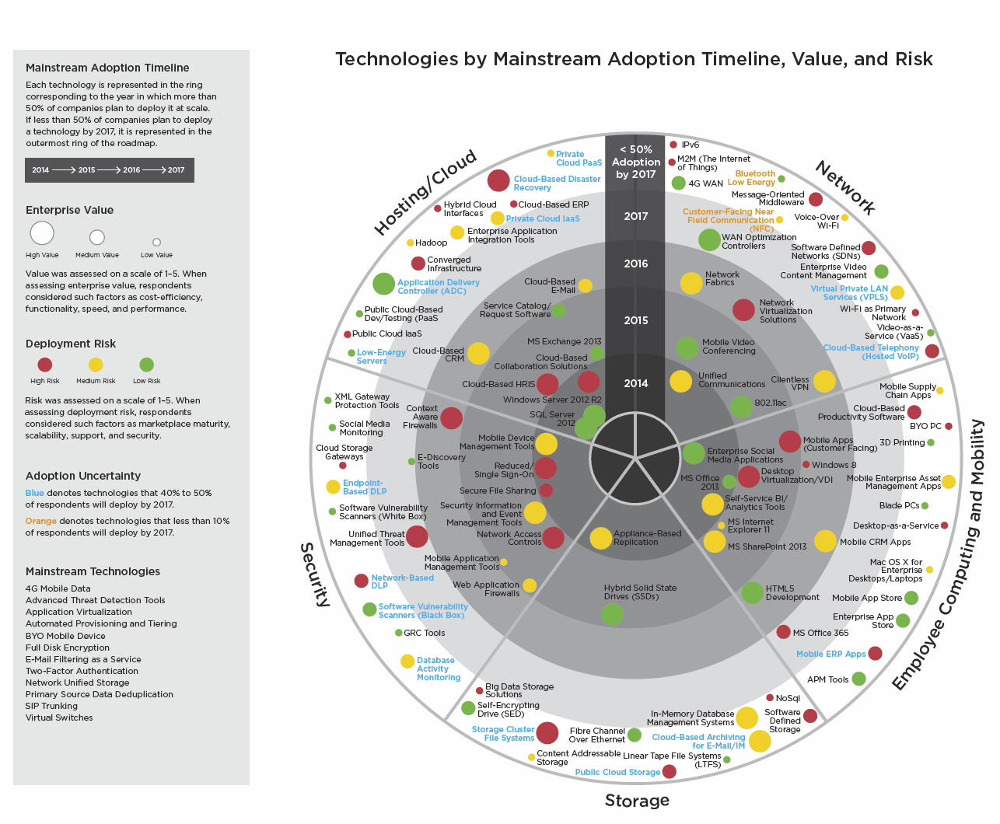

# Chapter 5

What's coming?

## What's in store in the world of ICT

<iframe src="http://riordan.ca/images/hype_cycle_2014.png" height=650 width=1050 scrolling=yes frameborder=0 seamless></iframe>

To begin, let's establish an excellent resource for looking up the gobbeldygook craziness of technology terminology. Need to know what a particular technology means in (almost) human terms? Check out Gartner's [IT Glossary](http://www.gartner.com/it-glossary/). Keep this resource close, You'll use it often.

We begin by looking at Gartner Group's Emerging Technology Hype Cycle. The 2014 version was the most recent available at time of writing.

Let's unpack the graphic. First of all, the Gartner Group is a large IT consultancy with offices worldwide and a great reputation in the IT consultancy field. Each year, they release research on emerging (up-and-coming) technology, and in a novel way, fit it to a curve of their own design. The curve is both a visual and semantic indicator of the _life_ of a piece of technology from Innovation Trigger (red section on the left of the chart) to Plateau of Productivity (the green section on the far right). [Here](http://www.smartinsights.com/managing-digital-marketing/marketing-innovation/technology-for-innovation-in-marketing/) are some historical ones for reference. 

There are five _phases_ to the cycle. Here's how each is explained by [Gartner](http://www.gartner.com/technology/research/methodologies/hype-cycle.jsp) with the authors comments in [square parens]:

"Each Hype Cycle drills down into the five key phases of a technology's life cycle.

"[Innovation] Trigger: A potential technology breakthrough kicks things off. Early proof-of-concept stories and media interest trigger significant publicity. Often no usable products exist and commercial viability is unproven. [Think of Twitter in the early days. It was cool for sure, but how to make money from it?]

"Peak of Inflated Expectations: Early publicity produces a number of success stories — often accompanied by scores of failures. Some companies take action; many do not. [This is the stage at which so-called _wearables_ (such as the Apple iWatch) are currently located. They are all cool and people are tripping over themselves to get them, but is there a real future or is it all hype? To frame it in the context of our book here, will they either reduce input requirements or increase outputs?]

"Trough of Disillusionment: Interest wanes as experiments and implementations fail to deliver. Producers of the technology shake out or fail. Investments continue only if the surviving providers improve their products to the satisfaction of early adopters. [Technology located here is not a failure! It's simple the lfe cycle stage where all the _hype_ has worn off. It's technology in the spot where it will either live or die; if it lives, it moves on to the Slope of Enlightenment" as productive applications are found and exploited.] 

"Slope of Enlightenment: More instances of how the technology can benefit the enterprise start to crystallize and become more widely understood. Second- and third-generation products appear from technology providers. More enterprises fund pilots; conservative companies remain cautious. [Note that 3D printing technologies are in this phase.]

"Plateau of Productivity: Mainstream adoption starts to take off. Criteria for assessing provider viability are more clearly defined. The technology's broad market applicability and relevance are clearly paying off."

[[Interested?](http://www.gartner.com/newsroom/id/2819918)]

And now the Emerging Technology Roadmap. 

